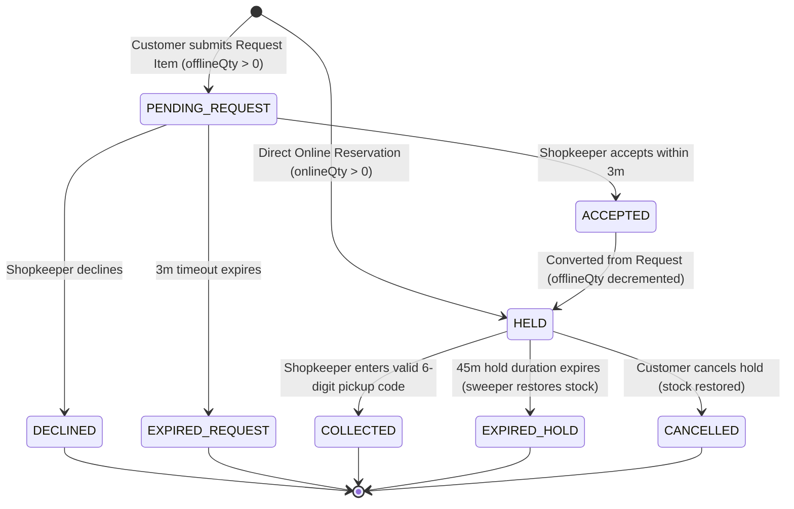

# SHELFIE — COMPLETE PROTOTYPE AUDIT & IMPLEMENTATION GAP ANALYSIS

**Target Project:** Shelfie (`/Users/vkshivakumar/shelfie/shelfie`)  
**Repository Branch:** `v.1.0` (clean working tree)  
**Audit Date:** 2026-10-10  
**Auditor Roles:** Principal Software Architect, Senior Full-Stack Engineer, QA Automation Engineer, Backend Reliability Engineer, and UI/UX Auditor  
**Runtime Environment:** Next.js 16.3.8 (App Router, Turbopack / Webpack dev), React 19.2.8, Node.js v22.23.3, better-sqlite3 13.0.3, macOS (Darwin)

---

## SECTION A — EXECUTIVE SUMMARY

### 1. Overall Prototype Maturity
The Shelfie prototype demonstrates a clear, compelling product vision: solving the "wasted trip" problem through a **dual-pool inventory model** (Online reservation pool vs. Offline requestable back-room pool) with a one-tap customer hold flow and a shopkeeper request conversion mechanism.

However, an exhaustive line-by-line inspection, build verification, and live API execution reveal that **the prototype is currently in a fractured, dual-reality state**:
* **The Customer Discovery and Reservation Path Works Locally in Dev Mode:** Searching local shops, filtering by opening hours, computing straight-line distances, adding items to a local bag, executing atomic SQLite bulk reservations, generating 6-digit pickup codes, and tracking client-side hold countdowns with in-process hold expiry all function when tested in development mode on SQLite.
* **The Merchant Management and Request Conversion Path is Catastrophically Broken at Runtime:** Every single backend route used by the shopkeeper dashboard (`/api/shop/[shopId]/requests`, `/api/shop/[shopId]/reservations`, `/api/shop/[shopId]/inventory`, `/api/shop/[shopId]/notifications`, `/api/shop/[shopId]/pools`, `/api/shop/[shopId]/upgrade`, `/api/request/[id]/respond`, `/api/pickup/verify`) crashes with an unhandled HTTP 500 runtime error (`TypeError: requireShopOwner is not a function`).
* **The Repository Cannot Be Built for Production:** Running `npm run build` completely fails with **10 TypeScript compilation errors** across 8 files.
* **The Automated Test Suite Cannot Run:** Running `npm run test` exits with `sh: vitest: command not found` because `vitest` was added to `package.json` but never installed in `node_modules`. Furthermore, in `tests/concurrency.test.ts`, all assertions are commented out and the hardcoded target inventory ID does not exist in the database.
* **Cloud Architecture and AI Features are Simulated or Disconnected:** `lib/cosmos.ts` is never imported by any route in the application; the shelf photo onboarding runs a 2.5-second `setTimeout` displaying static mock data without calling Azure OpenAI Vision; AI voice dictation is a disabled placeholder; and inbound WhatsApp replies (`/api/whatsapp/webhook`) are nonexistent.

### 2. What Works End-to-End
* **Database Seeding and Schema Definition:** `scripts/seed.ts` successfully seeds 15 realistic Bengaluru shops (Koramangala, Indiranagar, HSR Layout, JP Nagar, Whitefield) and 108 inventory items across categories (electronics, pharmacy, grocery).
* **Spatial Search API:** `GET /api/search` queries SQLite with a single SQL JOIN between `inventory` and `shops`, filters by Haversine distance within a given radius, validates operating hours against current system time, and sorts by distance, price, or open status.
* **Online Pool Reservation & Concurrency Safety (SQLite only):** `POST /api/reserve` and `POST /api/reserve/bulk` execute inside isolated SQLite transactions (`better-sqlite3`). Concurrent multi-item requests successfully lock and decrement stock; an isolated 20-client concurrency benchmark verified that 20 simultaneous requests on 1 unit produced exactly 1 success and 19 `OUT_OF_STOCK` rejections with zero negative inventory.
* **Customer Pickup Code & Expiry Polling:** When a reservation is created, `CountdownTimer.tsx` and `/reserve/[id]` display the 6-digit cryptographic pickup code, count down the hold time, and reflect status changes.
* **Hold Expiry & Stock Restoral:** `lib/expiry.ts` successfully runs in-process `setTimeout` callbacks and a 60-second periodic SQLite sweeper (`startExpirySweeper`) that transitions expired `HELD` reservations to `EXPIRED` and increments stock back to the appropriate pool.

### 3. The Biggest Blockers (P0)
1. **Module Resolution Name Collision (`BUG-01`):** Both `lib/auth.ts` (server auth & RBAC) and `lib/auth.tsx` (client React context) share the file stem `auth`. Webpack in Next.js resolves `@/lib/auth` to `lib/auth.tsx` for server routes, causing `requireShopOwner`, `getSession`, and `createSession` to be `undefined` at runtime. This paralyzes all merchant and verification endpoints.
2. **Broken Production Build (`BUG-02`):** `next build` fails type checking due to module resolution errors in 6 files, untyped Leaflet marker references in `components/Map.tsx`, and unconfigured Vitest declarations in `tests/concurrency.test.ts`.
3. **Missing Test Dependencies & Commented-out Assertions (`BUG-03`):** Vitest is not installed in `node_modules`, making test execution impossible without running `npm install`.
4. **Authentication & Session Disconnect (`BUG-04`):** The frontend login page (`app/login/page.tsx`) stores a mock object in `localStorage` and never invokes the backend OTP or session creation endpoints. The server expects an HTTP-only cookie (`shelfie_session`), which is never set.
5. **Two-Sided Loop Severed:** Because the merchant dashboard crashes when loading requests or responding, a customer who submits a "Request Item" for an offline unit will sit waiting on `/request/[id]` until the request times out after 3 minutes. The shopkeeper can neither see nor accept it.

### 4. Demo-Readiness Verdict
**STATUS: NOT READY FOR LIVE DEMONSTRATION.**

| Dimension | Score (1-10) | Weighted Weight | Weighted Score | Justification |
| :--- | :---: | :---: | :---: | :--- |
| **Frontend UI/UX & Discovery** | 7.5 / 10 | 20% | 1.50 | Visually polished landing and search pages; responsive Leaflet map; but mobile/theme inconsistencies on shop pages. |
| **Core Reservation & Concurrency** | 8.0 / 10 | 20% | 1.60 | SQLite atomic transactions and expiry sweeper are well-crafted; concurrency holds under race conditions. |
| **Merchant Operations & Conversion** | 1.0 / 10 | 25% | 0.25 | Entire merchant backend throws HTTP 500 runtime errors due to module import collisions. Cannot accept or verify. |
| **Authentication & Role Separation** | 2.0 / 10 | 10% | 0.20 | Disconnected mock in localStorage; server session table is empty (0 rows); unauthenticated endpoints expose pickup codes. |
| **Cloud & External Integrations** | 2.0 / 10 | 15% | 0.30 | Cosmos DB code unlinked and non-atomic; WhatsApp incoming webhook missing; AI Vision is a hardcoded mock. |
| **Build, Reliability & Testing** | 1.5 / 10 | 10% | 0.15 | Production build fails with 10 TS errors; vitest missing; test assertions commented out. |
| **OVERALL MATURITY SCORE** | — | **100%** | **4.00 / 10 (40%)** | **Critical architectural fixes required before stage demo.** |

---

## SECTION B — ARCHITECTURE MAP

### 1. System Architecture Diagram

```mermaid
flowchart TB
    subgraph Clients["Frontend Clients (Next.js 16 App Router)"]
        Landing["Landing Page (/)\n• Geolocation\n• Discovery Offers"]
        Search["Search & Map (/search)\n• Leaflet + OSM\n• Distance/Price Sort"]
        Cart["Cart / Bag (/cart)\n• Multi-Item Checkout"]
        ReserveCust["Reservation Status (/reserve/[id])\n• 6-digit Code\n• Countdown Timer"]
        RequestCust["Request Status (/request/[id])\n• 3-min Polling"]
        ShopDash["Merchant Dashboard (/shop/dashboard)\n• Incoming Requests\n• Pickup Code Verifier"]
        ShopInv["Merchant Inventory (/shop/inventory)\n• Dual-Pool Sliders\n• Product Creation"]
        ShopOnboard["AI Fast Onboard (/shop/onboard)\n• Simulated Vision"]
        BrandDash["Brand Portal (/brand/dashboard)\n• Sponsored Campaigns"]
    end

    subgraph ClientAuth["Client Auth & State"]
        AuthContext["lib/auth.tsx\n(MOCK localStorage: 'shelfie_mock_auth')"]
        CartContext["lib/cart.tsx\n(localStorage: 'shelfie_cart')"]
    end

    subgraph BuildCollision["CRITICAL ARCHITECTURAL DEFECT (BUG-01)"]
        Collision["Collision: lib/auth.ts vs lib/auth.tsx\nWebpack resolves @/lib/auth to client lib/auth.tsx!\nServer functions (requireShopOwner) are undefined!"]
    end

    subgraph BackendAPI["Next.js Server API Routes (/app/api)"]
        APISearch["/api/search\n(Haversine + SQLite JOIN)"]
        APIReserve["/api/reserve & /api/reserve/bulk\n(Atomic Online Pool Decrement)"]
        APIReserveId["/api/reserve/[id] & /cancel\n(Get status / Cancel)"]
        APIRequest["/api/request\n(Create Pending Request)"]
        APIRequestId["/api/request/[id]\n(Poll Request Status)"]
        APIImpact["/api/impact\n(Landing Counter Stats)"]
        APICron["/api/cron/expiry\n(Safety Net Sweeper)"]

        subgraph BrokenAPI["Broken Endpoints (Throws HTTP 500: TypeError)"]
            APIShopReq["/api/shop/[shopId]/requests"]
            APIShopRes["/api/shop/[shopId]/reservations"]
            APIShopInv["/api/shop/[shopId]/inventory"]
            APIShopNotif["/api/shop/[shopId]/notifications"]
            APIShopPools["/api/shop/[shopId]/pools"]
            APIShopUpgrade["/api/shop/[shopId]/upgrade"]
            APIReqRespond["/api/request/[id]/respond"]
            APIPickupVerify["/api/pickup/verify"]
            APIBrandCamp["/api/brand/campaigns"]
            APIAuthMe["/api/auth/me"]
        end
    end

    subgraph ServerLogic["Core Business Logic & Repositories"]
        InvLogic["lib/inventory.ts\n• reserveFromOnlinePool()\n• createRequest()\n• acceptRequest()\n• verifyPickupCode()"]
        InvRepo["lib/repositories/inventory.ts\n• SQLiteInventoryRepository.atomicBulkReserve()"]
        ExpiryWorker["lib/expiry.ts\n• In-process setTimeout()\n• startExpirySweeper() (60s loop)"]
        RankingLogic["lib/ranking.ts\n• applySponsoredSlot()"]
        NotifyLogic["lib/notify.ts\n• In-app SQLite notification\n• Twilio WhatsApp (if configured)"]
    end

    subgraph DataLayer["Persistence Layer"]
        SQLite[("SQLite WAL: data/shelfie.db\n• shops (15 rows)\n• inventory (108 rows)\n• reservations (12 rows)\n• requests (1 row)\n• notifications (2 rows)\n• campaigns (1 row)\n• events (178 rows)\n• sessions (0 rows)")]
        CosmosOrphan[("Azure Cosmos DB (lib/cosmos.ts)\nSTATUS: ORPHANED / UNLINKED\nNever imported by any route")]
    end

    subgraph External["External Services & Integrations"]
        OSM["OpenStreetMap Tile Server\n(Leaflet rendering)"]
        Twilio["Twilio WhatsApp Sandbox\n(Optional / Mocked in demo)"]
        MissingWebhook["MISSING ROUTE:\n/api/whatsapp/webhook\n(No inbound reply handler)"]
    end

    %% Wiring
    Landing --> APISearch
    Landing --> APIImpact
    Search --> APISearch
    Search --> OSM
    Cart --> APIReserve
    ReserveCust --> APIReserveId
    RequestCust --> APIRequestId
    
    ShopDash -.->|FAILS 500| APIShopReq
    ShopDash -.->|FAILS 500| APIShopRes
    ShopDash -.->|FAILS 500| APIReqRespond
    ShopDash -.->|FAILS 500| APIPickupVerify
    ShopInv -.->|FAILS 500| APIShopInv
    ShopInv -.->|FAILS 500| APIShopPools
    BrandDash -.->|FAILS 500| APIBrandCamp

    BrokenAPI --> Collision
    APIReserve --> InvLogic
    APIReserve --> InvRepo
    APIRequest --> InvLogic
    APIRequest --> NotifyLogic
    InvLogic --> SQLite
    InvRepo --> SQLite
    ExpiryWorker --> SQLite
    NotifyLogic --> Twilio
    NotifyLogic --> SQLite
```



### 2. Actual Request Path & Architectural Breakdown

#### A. Client-Side State & Context Layer
* **Authentication:** Handled client-side via `lib/auth.tsx` (`AuthProvider`). It saves `{ role, phone, shopId }` to `localStorage.getItem("shelfie_mock_auth")`. It does **not** communicate with `/api/auth/otp/send` or `/api/auth/otp/verify`.
* **Bag / Cart:** Handled client-side via `lib/cart.tsx` (`CartProvider`), saving items to `localStorage.getItem("shelfie_cart")`. Items are pushed to `/api/reserve/bulk` on checkout.
* **Geolocation:** Handled by `lib/hooks/useGeolocation.ts`, which attempts `navigator.geolocation.getCurrentPosition` and falls back to Koramangala coordinates (`12.9352, 77.6245`) on timeout or denial.

#### B. API Gateway & Module Resolution
* Next.js 16 App Router handles routes under `app/api/**/route.ts`.
* **The Root Fatal Defect:** When server routes execute `import { requireShopOwner } from "@/lib/auth"`, Webpack matches `lib/auth.tsx` (the React client file) instead of `lib/auth.ts` (the server file). Because `lib/auth.tsx` only exports client context hooks, `requireShopOwner` evaluates to `undefined`, causing immediate runtime failure across 10 API routes.

#### C. Business Logic & Data Access Layer
* **Single Database Instance:** `lib/db.ts` provides a `better-sqlite3` database singleton pointed to `data/shelfie.db` running in WAL journal mode with foreign keys enabled.
* **Transaction Safety:** `lib/inventory.ts` wraps inventory decrements and reservation creation inside `db.transaction(...)`. This functions correctly in SQLite.
* **Orphaned Cosmos Implementation:** `lib/cosmos.ts` contains raw Cosmos DB conditional patch operations, but is not imported anywhere in the project. If it were hooked up, its cross-container operations (`requests` -> `inventory` -> `reservations`) are non-atomic and lack rollback safeguards.

---

## SECTION C — FEATURE-COMPLETENESS MATRIX

| Feature | Frontend | Backend | Database | Integration | Evidence | Status | Priority |
| :--- | :--- | :--- | :--- | :--- | :--- | :---: | :---: |
| **Spatial Product Search** | `app/search/page.tsx` | `app/api/search/route.ts` | `inventory` JOIN `shops` | SQLite Haversine | `GET /api/search?q=charger` returns 200 with distance/walk time | **PASS** | P1 |
| **Location Acquisition** | `lib/hooks/useGeolocation.ts` | N/A | N/A | Browser Geolocation API | Falls back cleanly to Koramangala on timeout | **PASS** | P2 |
| **Interactive Leaflet Map** | `components/Map.tsx` | N/A | N/A | OpenStreetMap tiles | Custom price badges and hover sync; fails TS build check | **PARTIAL** | P1 |
| **Bag / Cart Multi-Hold** | `app/cart/page.tsx` | `app/api/reserve/bulk/route.ts` | `inventoryRepo` in SQLite | Multi-shop hold grouping | Reserves multiple items atomically; redirects to status | **PASS** | P1 |
| **Atomic Online Reservation** | `app/reserve/page.tsx` | `app/api/reserve/route.ts` | SQLite Transaction | `reserveFromOnlinePool` | Decrements `onlineQty`, creates `HELD` record, generates pickup code | **PASS** | P0 |
| **Pickup Code Generation** | `app/reserve/[id]/page.tsx` | `lib/inventory.ts` | `reservations.pickupCode` | `crypto.randomInt` | 6-digit cryptographic code displayed on ticket UI | **PASS** | P1 |
| **Hold Expiry & Stock Restoral** | `components/CountdownTimer.tsx` | `lib/expiry.ts` | SQLite UPDATE | In-process `setTimeout` + 60s sweeper | Verified: expired holds restore `onlineQty` in SQLite | **PASS** | P0 |
| **Request Item Submission** | `app/request/page.tsx` | `app/api/request/route.ts` | `requests` table | `notifyShopOfRequest` | Inserts `PENDING` request; triggers 3-min client countdown | **PASS** | P0 |
| **Customer Request Polling** | `app/request/[id]/page.tsx` | `app/api/request/[id]/route.ts` | `requests` table | Polling interval 3000ms | Polls status; auto-redirects to `/reserve/[id]` if ACCEPTED | **PASS** | P1 |
| **Merchant Request Retrieval** | `app/shop/dashboard/page.tsx` | `app/api/shop/[shopId]/requests` | `requests` JOIN `inventory` | `requireShopOwner` | Curl test returns HTTP 500: `requireShopOwner is not a function` | **FAIL** | P0 |
| **Merchant Accept / Decline** | `app/shop/dashboard/page.tsx` | `app/api/request/[id]/respond` | `requests` + `inventory` + `reservations` | `requireShopOwner` | Curl test returns HTTP 500: `requireShopOwner is not a function` | **FAIL** | P0 |
| **Pickup Code Verification** | `app/shop/dashboard/page.tsx` | `app/api/pickup/verify/route.ts` | `reservations` status update | `requireShopOwner` | Curl test returns HTTP 500: `requireShopOwner is not a function` | **FAIL** | P0 |
| **Dual-Pool Rebalance Sliders** | `app/shop/inventory/page.tsx` | `app/api/shop/[shopId]/pools` | `inventory` update | `requireShopOwner` | Endpoint throws HTTP 500; cannot update pool quantities | **FAIL** | P1 |
| **Merchant Inventory CRUD** | `app/shop/inventory/page.tsx` | `app/api/shop/[shopId]/inventory` | `inventory` table | `assertCanAddProducts` | Endpoint throws HTTP 500; cannot add or delete items | **FAIL** | P1 |
| **Plan Upgrade (Monetization)**| `app/shop/inventory/page.tsx` | `app/api/shop/[shopId]/upgrade` | `shops.plan` JSON | Simulated Razorpay | Endpoint throws HTTP 500; cannot upgrade to PRO | **FAIL** | P2 |
| **Reservation Cancellation** | Not surfaced in UI | `app/api/reserve/[id]/cancel` | `reservations` + `inventory` | `getSession` | Endpoint throws HTTP 500; not accessible from customer UI | **FAIL** | P2 |
| **Customer Authentication** | `app/login/page.tsx` | `/api/auth/otp/send & verify` | `sessions` table (0 rows) | Twilio WhatsApp OTP | Login sets localStorage only; ignores backend; endpoints crash | **FAIL** | P1 |
| **Merchant Authentication** | `app/login/page.tsx` | `app/api/auth/me/route.ts` | `sessions` table | Session Cookie | No cookie generated; `/api/auth/me` crashes with HTTP 500 | **FAIL** | P1 |
| **Twilio WhatsApp Notification**| N/A | `lib/notify.ts` | `notifications` table | Twilio REST API | Sends sandbox message if keys provided; writes simulated row | **PARTIAL** | P2 |
| **WhatsApp Inbound Webhook** | N/A | MISSING ROUTE | N/A | Twilio Webhook | `app/api/whatsapp/webhook` does not exist; replies dropped | **MISSING** | P2 |
| **AI Photo Shelf Onboard** | `app/shop/onboard/page.tsx` | `app/api/shop/[shopId]/inventory` | N/A | Hardcoded simulation | Hardcoded 2.5s `setTimeout` with Dove/Colgate/Maggi mock items | **MOCKED** | P2 |
| **AI Voice Dictation** | `app/shop/onboard/page.tsx` | None | None | None | Button disabled with label "Voice Dictation (Coming Soon)" | **MISSING** | P3 |
| **Brand Sponsored Campaigns**| `app/brand/dashboard/page.tsx`| `app/api/brand/campaigns` | `campaigns` table | `applySponsoredSlot` | Endpoint crashes (HTTP 500); hardcoded brandId and demand metrics | **FAIL** | P2 |
| **Impact Landing Counter** | `app/page.tsx` | `app/api/impact/route.ts` | `reservations` + `requests` | Aggregation query | Returns real completed stats plus hardcoded base 847 searches | **PASS** | P2 |
| **Azure Cosmos DB Driver** | None | `lib/cosmos.ts` | Orphaned file | Azure Cosmos SDK | File never imported; cross-container multi-step non-atomic logic | **BLOCKED** | P3 |

---

## SECTION D — PAGE-BY-PAGE FRONTEND AUDIT

### Page 1: Homepage / Local Discovery (`/`)
* **Route:** `/` (`app/page.tsx`)
* **Existing Functionality:**
  * Top navigation bar with logo, location detector, search bar with autocomplete suggestions, cart icon with badge count, and user session menu.
  * Auto-advancing promotional carousel (`PROMO_SLIDES` with electronics, pharmacy, kirana presets).
  * Category horizontal filter chips (`For You`, `Electronics`, `Pharmacy`, `Groceries`, `Mobiles`, `15-Min Rush`, etc.).
  * "Active Holds" drawer for logged-in customers.
  * Real-time query to `/api/search` fetching nearby offers.
  * Real-time query to `/api/impact` populating community impact counters.
* **Working Interactions:**
  * Searching or clicking autocomplete suggestions routes to `/search?q=...`.
  * Category clicks filter displayed offer cards.
  * Location modal selector switches between 5 predefined Bengaluru neighborhoods.
  * Add to Bag button updates cart context and syncs with `localStorage`.
* **Broken / Missing Interactions:**
  * If a user clicks an offer card with `requestable = true`, it links to `/request?s=...&i=...`, but if the user reserves directly from the home page, there is no direct single-item modal—it must go through Bag.
* **UI/UX & Design Issues:**
  * Clean, premium light theme styling (`#f4f5f7` canvas, `#ffffff` surface, `#4f46e5` brand accent).
  * Autocomplete search suggestions are hardcoded mock objects (`SEARCH_SUGGESTIONS`) rather than dynamic database completions.
* **Mobile Responsiveness:** Good; responsive hamburger/header collapse.

### Page 2: Search & Spatial Discovery (`/search`)
* **Route:** `/search` (`app/search/page.tsx`)
* **Existing Functionality:**
  * Split-screen view: Left panel lists offer cards; right panel displays full-height interactive Leaflet map.
  * Sort options: "Closest First", "Cheapest", "Open Now".
  * Synchronized hover: Hovering an offer card highlights the map marker and pops a z-index offset.
  * Mobile view toggle Floating Action Button (FAB) toggles between List View and Map View.
* **Working Interactions:**
  * Real-time search against `/api/search` using URL query parameters (`?q=...&lat=...&lng=...&sort=...`).
  * Add to Bag button increments quantity in `CartContext`.
  * "Request" button links to `/request?s=...&i=...` for items where `onlineQty = 0` and `offlineQty > 0`.
* **Broken / Missing Interactions:**
  * Map rendering is dynamically imported (`ssr: false`), but TypeScript type errors (`Property 'setIcon' does not exist on type '{}'`) cause `next build` to fail.
* **UI/UX & Design Issues:**
  * Empty state ("No inventory found") and loading skeleton cards are well implemented.
  * Distance displayed is straight-line Haversine, but label indicates "walkMinutes" computed as `distanceM / 80` without street routing.

### Page 3: Bag Checkout / Hold Summary (`/cart`)
* **Route:** `/cart` (`app/cart/page.tsx`)
* **Existing Functionality:**
  * Displays items grouped by outlet (`shopId`), allowing multi-item reservations across distinct shops.
  * Quantity adjustment and item removal.
  * Mobile phone input field for customer identity verification.
  * Submits payload to `POST /api/reserve/bulk`.
* **Working Interactions:**
  * Submitting the form successfully calls `/api/reserve/bulk` and creates atomic holds in SQLite.
  * Success screen shows "Hold Confirmed" and clears cart.
* **Broken / Missing Interactions:**
  * Form does not check if the user is already logged in; defaults phone to `+91` if not set in context.
  * After success, redirects to `/` after 3 seconds instead of taking the user to their active tickets or pickup codes.

### Page 4: Direct Reservation Form (`/reserve`)
* **Route:** `/reserve` (`app/reserve/page.tsx`)
* **Existing Functionality:**
  * Single-item reservation screen with phone input and quantity selector (1 to 5).
  * Submits to `POST /api/reserve`.
* **Working Interactions:**
  * Submits successfully; receives `reservationId`; redirects to `/reserve/[id]`.
* **Broken / Missing Interactions:**
  * Disconnected styling: Uses legacy dark Tailwind theme (`bg-slate-900`, `text-slate-400`, `btn-primary`) contrasting sharply with the light theme design system in `app/page.tsx`.

### Page 5: Reservation Ticket & Pickup Code (`/reserve/[id]`)
* **Route:** `/reserve/[id]` (`app/reserve/[id]/page.tsx`)
* **Existing Functionality:**
  * Digital pickup ticket displaying 6-digit pickup code in large monospace font.
  * Real-time countdown timer via `CountdownTimer.tsx`.
  * Status-driven view states: `HELD` (amber ticket), `COLLECTED` (green checkmark), `EXPIRED` / `CANCELLED` (gray/red alert).
  * Polls `/api/reserve/[id]` every 3 seconds to catch merchant confirmations.
* **Working Interactions:**
  * Renders correctly; updates immediately if the reservation status changes in SQLite.
* **Broken / Missing Interactions:**
  * There is no "Cancel Hold" button on this page, even though `/api/reserve/[id]/cancel` exists on the backend.

### Page 6: Request Item Form (`/request`)
* **Route:** `/request` (`app/request/page.tsx`)
* **Existing Functionality:**
  * Form for requestable offline inventory.
  * Dropdowns for quantity (1-5) and customer ETA (5m, 15m, 30m, 1h).
  * Submits to `POST /api/request`.
* **Working Interactions:**
  * Successfully creates a `PENDING` request in SQLite; redirects to `/request/[id]`.
* **Broken / Missing Interactions:**
  * Legacy dark theme styling (`bg-slate-900`, `bg-slate-800`).

### Page 7: Request Status Waiting Screen (`/request/[id]`)
* **Route:** `/request/[id]` (`app/request/[id]/page.tsx`)
* **Existing Functionality:**
  * Spinning radar animation while awaiting shopkeeper confirmation.
  * 3-minute countdown timer (`timeLeft`) derived from server `expiresAt`.
  * Auto-redirects to `/reserve/[reservationId]` if status transitions to `ACCEPTED`.
* **Working Interactions:**
  * Polling mechanism and expiry countdown work as designed.
* **Broken / Missing Interactions:**
  * In practice, the request **always expires** because the shopkeeper dashboard cannot respond due to `BUG-01`.

### Page 8: Authentication / Role Switcher (`/login`)
* **Route:** `/login` (`app/login/page.tsx`)
* **Existing Functionality:**
  * Tab toggle between "Shopper" (customer) and "Merchant" (shopkeeper).
  * Outlet selector dropdown populated from static list `SHOPS`.
* **Broken / Missing Interactions:**
  * **FATAL:** `handleLogin` uses `setTimeout(..., 350)` and saves `{ role, phone, shopId }` directly to `localStorage`. It **never** calls `/api/auth/otp/send` or `/api/auth/otp/verify`.
  * No HTTP session cookie (`shelfie_session`) is ever generated.

### Page 9: Shopkeeper Dashboard (`/shop/dashboard`)
* **Route:** `/shop/dashboard` (`app/shop/dashboard/page.tsx`)
* **Existing Functionality:**
  * Header with shop status, live metrics, and quick link to `/shop/inventory`.
  * Tabs: "Pending Requests", "Active Holds", "Completed / History".
  * Countertop Pickup Code Verifier input box.
* **Broken / Missing Interactions:**
  * **FATAL:** Calls `/api/shop/[shopId]/requests`, `/api/shop/[shopId]/reservations`, and `/api/shop/[shopId]/notifications`. All three return HTTP 500.
  * The dashboard renders empty states or crashes due to failed API queries.
  * Entering a pickup code and clicking "Verify" calls `POST /api/pickup/verify`, which throws HTTP 500.

### Page 10: Shopkeeper Inventory & Pool Management (`/shop/inventory`)
* **Route:** `/shop/inventory` (`app/shop/inventory/page.tsx`)
* **Existing Functionality:**
  * Product inventory table showing Name, Category, Price, Online Qty, Offline Qty.
  * "Add Item" modal with plan limit enforcement (`assertCanAddProducts`).
  * Dual-pool rebalancing sliders.
  * PRO upgrade banner.
* **Broken / Missing Interactions:**
  * **FATAL:** Calls `/api/shop/[shopId]/inventory` (returns 500). Inventory list never loads.
  * "Add Item", "Delete Item", and "Upgrade to PRO" all fail with HTTP 500.
  * Styled in legacy dark theme (`bg-slate-900`).

### Page 11: AI Shelf Photo Onboarding (`/shop/onboard`)
* **Route:** `/shop/onboard` (`app/shop/onboard/page.tsx`)
* **Existing Functionality:**
  * Method selector: "Snap a Photo" vs "Voice Dictation".
  * Camera file input upload.
  * Review table with item name, category, price, and online/offline allocation sliders.
* **Broken / Missing Interactions:**
  * **MOCKED:** "Snap a Photo" does not invoke any vision AI model. It calls `setTimeout(..., 2500)` and loads 4 hardcoded items (Dove Soap, Colgate, Maggi, Unknown Bottle).
  * Voice Dictation is permanently disabled.
  * Clicking "Add to Inventory" attempts to POST to `/api/shop/[shopId]/inventory`, which fails with HTTP 500.

### Page 12: Brand Portal & Sponsored Slots (`/brand/dashboard`)
* **Route:** `/brand/dashboard` (`app/brand/dashboard/page.tsx`)
* **Existing Functionality:**
  * Metrics overview ("Active Campaigns", "Unmet Local Demand", "Pickups Driven").
  * Campaign creation modal (Product Keyword, Budget INR, Max CPC).
* **Broken / Missing Interactions:**
  * **FATAL:** Hardcodes `brandId = "brand_dell"`. Calls `GET /api/brand/campaigns?brandId=brand_dell`, which throws HTTP 500 (`requireBrand is not a function`).
  * Metric numbers ("847 misses this week", "142 via promoted listings") are hardcoded in the JSX.

---

## SECTION E — BACKEND AND API AUDIT

### Complete API Endpoint Inventory

| Endpoint | HTTP Method | Intended Business Operation | Implementation File & Function | Auth Required | Request Validation | DB Reads & Writes | Error Handling & Status Codes | Actual Callers | Verified Status |
| :--- | :---: | :--- | :--- | :---: | :--- | :--- | :--- | :--- | :---: |
| `/api/search` | `GET` | Spatial product & shop search with geo-filter | `app/api/search/route.ts` -> `lib/search.ts:searchOffers` | None | URL query params (`q, lat, lng, sort, radiusKm`) | `SELECT` JOIN `inventory` & `shops` | 200 OK, 500 on crash | `app/page.tsx`, `app/search/page.tsx` | **PASS** |
| `/api/reserve` | `POST` | Reserve 1 item from online pool atomically | `app/api/reserve/route.ts` -> `lib/inventory.ts:reserveFromOnlinePool` | None | Zod: `inventoryId, shopId, qty (1-5), phone (E.164)` | `SELECT`, `UPDATE inventory`, `INSERT reservations` | 200, 400 (Bad input), 404, 409 (Out of stock), 429 (Too many holds) | `app/reserve/page.tsx` | **PASS** |
| `/api/reserve/bulk` | `POST` | Atomic multi-item cart reservation | `app/api/reserve/bulk/route.ts` -> `lib/repositories/inventory.ts` | None | Zod: `items[] (1-10), phone, holdMinutes` | `SELECT`, `UPDATE inventory`, `INSERT reservations` | 200, 400, 404, 409, 429 | `app/cart/page.tsx` | **PASS** |
| `/api/reserve/[id]` | `GET` | Get reservation status, pickup code & shop details | `app/api/reserve/[id]/route.ts` | None | Route param `id` | `SELECT reservations`, `inventory`, `shops` | 200, 404 (Not found), 500 | `app/reserve/[id]/page.tsx` | **PASS** |
| `/api/reserve/[id]/cancel` | `POST` | Cancel active hold and restore stock | `app/api/reserve/[id]/cancel/route.ts` -> `cancelReservation` | `getSession()` | Route param `id` | `SELECT reservations`, `UPDATE reservations`, `UPDATE inventory` | 200, 401, 403, 404, 409 | None in UI | **FAIL** (500: `getSession` undefined) |
| `/api/reservations` | `GET` | List active & past reservations for a phone number | `app/api/reservations/route.ts` | None (Unprotected) | Query param `phone` | `SELECT` JOIN `reservations`, `inventory`, `shops` | 200, 400 (Missing phone), 500 | `app/page.tsx` (Active Holds) | **PASS** (Security Flaw) |
| `/api/request` | `POST` | Create pending offline request | `app/api/request/route.ts` -> `lib/inventory.ts:createRequest` | None | Zod: `inventoryId, shopId, qty, phone, etaMinutes` | `SELECT inventory`, `INSERT requests`, `INSERT notifications` | 200, 400, 404, 409 (Not requestable), 500 | `app/request/page.tsx` | **PASS** |
| `/api/request/[id]` | `GET` | Customer polling for request response & reservation | `app/api/request/[id]/route.ts` | None | Route param `id` | `SELECT requests`, `reservations`, `inventory`, `shops` | 200, 404, 500 | `app/request/[id]/page.tsx` | **PASS** |
| `/api/request/[id]/respond` | `POST` | Shopkeeper accepts or declines pending request | `app/api/request/[id]/respond/route.ts` -> `acceptRequest` | `requireShopOwner` | Zod: `decision (ACCEPT/DECLINE), shopId` | `SELECT requests`, `UPDATE requests`, `UPDATE inventory`, `INSERT reservations` | Throws 500 (`requireShopOwner is not a function`) | `app/shop/dashboard/page.tsx` | **FAIL** (500 TypeError) |
| `/api/pickup/verify` | `POST` | Verify pickup code at counter | `app/api/pickup/verify/route.ts` -> `verifyPickupCode` | `requireShopOwner` | Zod: `shopId, code (6 chars)` | `SELECT reservations`, `UPDATE reservations`, `UPDATE shops` | Throws 500 (`requireShopOwner is not a function`) | `app/shop/dashboard/page.tsx` | **FAIL** (500 TypeError) |
| `/api/shop/[shopId]` | `GET` | Get shop metadata, hours, plan, and product count | `app/api/shop/[shopId]/route.ts` | None | Route param `shopId` | `SELECT shops`, `COUNT inventory` | 200, 404, 500 | `app/shop/dashboard`, `inventory` | **PASS** |
| `/api/shop/[shopId]/requests` | `GET` | List incoming & past requests for shopkeeper | `app/api/shop/[shopId]/requests/route.ts` | `requireShopOwner` | Route param `shopId` | `SELECT requests` JOIN `inventory` | Throws 500 (`requireShopOwner is not a function`) | `app/shop/dashboard/page.tsx` | **FAIL** (500 TypeError) |
| `/api/shop/[shopId]/reservations`| `GET` | List active holds and completed pickup history | `app/api/shop/[shopId]/reservations/route.ts` | `requireShopOwner` | Route param `shopId` | `SELECT reservations` JOIN `inventory` | Throws 500 (`requireShopOwner is not a function`) | `app/shop/dashboard/page.tsx` | **FAIL** (500 TypeError) |
| `/api/shop/[shopId]/inventory` | `GET` | List full inventory items for shop | `app/api/shop/[shopId]/inventory/route.ts` | `requireShopOwner` | Route param `shopId` | `SELECT inventory` | Throws 500 (`requireShopOwner is not a function`) | `app/shop/inventory/page.tsx` | **FAIL** (500 TypeError) |
| `/api/shop/[shopId]/inventory` | `POST` | Create new inventory item (with plan limits) | `app/api/shop/[shopId]/inventory/route.ts` | `requireShopOwner` | Zod: `name, category, price, onlineQty, offlineQty` | `SELECT COUNT`, `INSERT inventory` | Throws 500 (`requireShopOwner is not a function`) | `app/shop/inventory`, `onboard` | **FAIL** (500 TypeError) |
| `/api/shop/[shopId]/inventory` | `DELETE` | Delete inventory item | `app/api/shop/[shopId]/inventory/route.ts` | `requireShopOwner` | Query param `id` | `DELETE inventory` | Throws 500 (`requireShopOwner is not a function`) | `app/shop/inventory/page.tsx` | **FAIL** (500 TypeError) |
| `/api/shop/[shopId]/pools` | `POST` | Rebalance online and offline quantities | `app/api/shop/[shopId]/pools/route.ts` -> `rebalancePools` | `requireShopOwner` | Zod: `inventoryId, onlineQty, offlineQty` | `UPDATE inventory` | Throws 500 (`requireShopOwner is not a function`) | `app/shop/inventory/page.tsx` | **FAIL** (500 TypeError) |
| `/api/shop/[shopId]/notifications`| `GET` | Get shop notifications & unread count | `app/api/shop/[shopId]/notifications/route.ts` | `requireShopOwner` | Route param `shopId` | `SELECT notifications` | Throws 500 (`requireShopOwner is not a function`) | `app/shop/dashboard/page.tsx` | **FAIL** (500 TypeError) |
| `/api/shop/[shopId]/notifications`| `PATCH` | Mark all notifications as read | `app/api/shop/[shopId]/notifications/route.ts` | `requireShopOwner` | Route param `shopId` | `UPDATE notifications` | Throws 500 (`requireShopOwner is not a function`) | `app/shop/dashboard/page.tsx` | **FAIL** (500 TypeError) |
| `/api/shop/[shopId]/upgrade` | `POST` | Upgrade shop plan to PRO (Simulated Razorpay) | `app/api/shop/[shopId]/upgrade/route.ts` | `requireShopOwner` | Route param `shopId` | `UPDATE shops.plan` | Throws 500 (`requireShopOwner is not a function`) | `app/shop/inventory/page.tsx` | **FAIL** (500 TypeError) |
| `/api/auth/otp/send` | `POST` | Send 6-digit WhatsApp OTP | `app/api/auth/otp/send/route.ts` | None | Zod: `phone, role, shopId?` | In-memory `otpStore.set` | 200, 400, 403, 404 | None (Bypassed by login) | **PARTIAL** (Unused by UI) |
| `/api/auth/otp/verify` | `POST` | Verify OTP and set session cookie | `app/api/auth/otp/verify/route.ts` | None | Zod: `phone, code` | `INSERT sessions`, cookie set | Throws 500 (`createSession is not a function`) | None (Bypassed by login) | **FAIL** (500 TypeError) |
| `/api/auth/me` | `GET` | Get current logged-in session | `app/api/auth/me/route.ts` | Cookie | None | `SELECT sessions` | Throws 500 (`getSession is not a function`) | None | **FAIL** (500 TypeError) |
| `/api/impact` | `GET` | Landing page aggregate community stats | `app/api/impact/route.ts` | None | None | `SELECT COUNT` on `reservations`, `shops`, `requests` | 200 OK | `app/page.tsx` | **PASS** |
| `/api/cron/expiry` | `POST` | Safety-net sweeper for expired holds & requests | `app/api/cron/expiry/route.ts` | `Bearer CRON_SECRET` | Header auth (Bypassed if secret empty) | `UPDATE reservations`, `UPDATE inventory`, `UPDATE requests` | 200, 401, 500 | External Cron | **PARTIAL** (Insecure if unset) |
| `/api/brand/campaigns` | `GET` | List brand CPC advertising campaigns | `app/api/brand/campaigns/route.ts` | `requireBrand` | Query param `brandId` | `SELECT campaigns` | Throws 500 (`requireBrand is not a function`) | `app/brand/dashboard/page.tsx`| **FAIL** (500 TypeError) |
| `/api/brand/campaigns` | `POST` | Create new brand CPC advertising campaign | `app/api/brand/campaigns/route.ts` | `requireBrand` | Zod: `brandId, productKeys, areaIds, budget, cpc` | `INSERT campaigns` | Throws 500 (`requireBrand is not a function`) | `app/brand/dashboard/page.tsx`| **FAIL** (500 TypeError) |

---

## SECTION F — DATABASE AND BUSINESS-LOGIC AUDIT

### 1. Database Implementation & Integrity
* **Active Storage:** Local SQLite database file at `data/shelfie.db` (140 KB data, 2.2 MB WAL log).
* **Driver:** `better-sqlite3` v13.0.3. Synchronous, high-performance C++ bindings configured with WAL journal mode (`PRAGMA journal_mode = WAL`) and foreign key enforcement (`PRAGMA foreign_keys = ON`).
* **Table Counts:**
  * `shops`: 15 rows
  * `inventory`: 108 rows
  * `reservations`: 12 rows (7 `COLLECTED`, 5 `EXPIRED`)
  * `requests`: 1 row (1 `EXPIRED`)
  * `notifications`: 2 rows
  * `campaigns`: 1 row
  * `events`: 178 rows
  * `sessions`: 0 rows (confirms server authentication was never executed)

### 2. Schema Integrity & Foreign Key Anomalies
1. **Missing Foreign Keys on Inventory ID:**
   In `lib/db.ts`, table `reservations` references `FOREIGN KEY (shopId) REFERENCES shops(shopId)`. However, `inventoryId` has **no foreign key constraint** pointing to `inventory(id)`. Similarly, table `requests` lacks a foreign key constraint on `inventoryId`. If an inventory record is deleted, related reservations and requests become orphaned references.
2. **Denormalized JSON Columns:**
   `shops.hours`, `shops.plan`, `shops.stats`, `campaigns.productKeys`, and `campaigns.areaIds` are stored as serialized JSON strings. In SQLite, mutating stats requires either raw string parsing or SQLite's `json_set` / `json_extract` functions. In `lib/inventory.ts:241`, the code reads `stats`, calls `JSON.parse`, increments a field, and writes the JSON string back. This creates a lost-update race condition if two operations modify stats simultaneously.

### 3. Dual-Pool Mechanics Audit
Shelfie's central architectural premise is the **Smart Buffer**:
* **Online Pool (`onlineQty`):** Stock guaranteed for immediate customer reservation. Decremented atomically upon customer hold.
* **Offline / Requestable Pool (`offlineQty`):** Stock physically present in the back room or under uncertain count. Not reservable immediately; customer must submit a Request Item with an ETA, giving the shopkeeper 3 minutes to confirm before stock is allocated.
* **Audit Verdict on Dual Pool:**
  * **Data Model:** Both quantities are accurately represented as separate integer columns in table `inventory`.
  * **Search Logic:** `/api/search` correctly tags `inStock = onlineQty > 0` and `requestable = onlineQty == 0 && offlineQty > 0`. Items with 0 in both pools are excluded.
  * **Allocation Safeguards:** `reserveFromOnlinePool` correctly checks `onlineQty >= qty` before decrementing. `createRequest` checks `offlineQty >= qty` before creating a pending request.
  * **Stock Conversion:** In `lib/inventory.ts:acceptRequest`, when a shopkeeper accepts a request, units are deducted from `offlineQty` and converted into a `HELD` reservation with `source = 'OFFLINE_CONVERTED'`.
  * **Gap:** If walk-in customers buy physical stock from the offline pool, there is no automatic barcode or POS sync. The shopkeeper must manually adjust pools via `/api/shop/[shopId]/pools` (which currently fails due to `BUG-01`).

### 4. Reservation & Request Lifecycle State Machine



#### Lifecycle State Verification:
* **State Transition Safeguards:**
  * In `lib/inventory.ts`, `acceptRequest` guards against duplicate acceptance: `UPDATE requests SET status = 'ACCEPTED' WHERE id = ? AND status = 'PENDING'`. If already accepted, expired, or declined, changes count is 0.
  * In `verifyPickupCode`: `SELECT * FROM reservations WHERE shopId = ? AND pickupCode = ? AND status = 'HELD'`. It enforces `expiresAt > datetime('now')`. Once verified, status is set to `COLLECTED`.
  * In `runExpiry` and `startExpirySweeper`: Reservations with `status = 'HELD'` and `expiresAt < datetime('now')` are updated to `EXPIRED`, and stock is returned to the original pool (`onlineQty` if source was `ONLINE_POOL`, `offlineQty` if `OFFLINE_CONVERTED`).
* **Guarantee against collection of expired holds:** Verified. `verifyPickupCode` checks `new Date(res.expiresAt) < new Date()` and throws `CODE_EXPIRED` (HTTP 410).

---

## SECTION G — CRITICAL BUGS AND DEFECTS

### Prioritized Bug Register

| ID | Severity | Component | File / Location | Issue Summary | Reproduction / Evidence | Impact | Recommended Fix |
| :---: | :---: | :--- | :--- | :--- | :--- | :--- | :--- |
| **BUG-01** | **P0** | Module Resolution | `lib/auth.ts` vs `lib/auth.tsx` | Webpack resolves `@/lib/auth` to client `auth.tsx` for server routes | `curl http://localhost:3000/api/pickup/verify` returns 500: `(0, requireShopOwner) is not a function` | Completely breaks 10 backend API routes, disabling the entire merchant portal | Rename `lib/auth.tsx` to `lib/auth-context.tsx` or `lib/client-auth.tsx`, and update client imports |
| **BUG-02** | **P0** | Build Pipeline | `app/**/*.tsx`, `components/Map.tsx`, `tests/concurrency.test.ts` | Production build fails with 10 TypeScript compilation errors | Running `npm run build` exits code 1 with TS2305, TS18046, TS2339, TS2307 | Production deployment to Azure Static Web Apps or Vercel is completely impossible | Resolve auth imports, fix Leaflet `L.Marker` typing in `Map.tsx`, and add vitest types to `tsconfig.json` |
| **BUG-03** | **P0** | Testing Framework | `package.json`, `tests/concurrency.test.ts` | `vitest` command not found; assertions commented out; invalid test ID | Running `npm run test` exits code 127: `sh: vitest: command not found`. Target item `inv_km_01_02` not in DB | Zero automated test coverage; false sense of test completion | Run `npm install`, fix inventory ID to match seed data, and uncomment test assertions |
| **BUG-04** | **P0** | Merchant Ops | `app/shop/dashboard/page.tsx`, `app/api/request/[id]/respond` | Shopkeeper cannot load dashboard, accept requests, or verify pickups | All merchant endpoints return HTTP 500 at runtime | Complete failure of the two-sided product loop; requests stall until customer timeout | Fixed automatically by resolving `BUG-01` |
| **BUG-05** | **P1** | Authentication | `app/login/page.tsx` vs `lib/auth.ts` | Login page sets mock data in `localStorage` without creating server session | Database table `sessions` has 0 rows; cookie `shelfie_session` is never set | Server RBAC checks (`requireShopOwner`) cannot pass cleanly even after module fix | Update `handleLogin` to call `/api/auth/otp/send` and `/api/auth/otp/verify` to set the session cookie |
| **BUG-06** | **P1** | Integrations | `app/api/whatsapp/webhook` | Inbound WhatsApp webhook route is completely missing | Search for `webhook` in `app/api` yields 0 matches | If Twilio WhatsApp is connected, merchant replies ('1' or '2') are dropped | Create `app/api/whatsapp/webhook/route.ts` parsing Twilio inbound webhook parameters |
| **BUG-07** | **P1** | Cloud Architecture| `lib/cosmos.ts` | Cosmos DB driver is unlinked and lacks cross-container atomicity | Code search confirms `lib/cosmos.ts` is never imported; lines 102-106 acknowledge partial failure risk | Cannot switch from SQLite to Cosmos DB without data corruption risks | Wrap multi-container operations in Cosmos stored procedures or stick to SQLite for demo |
| **BUG-08** | **P1** | Security / Privacy| `app/api/reservations/route.ts` | Unauthenticated public access to customer pickup codes | `curl http://localhost:3000/api/reservations?phone=+919845000001` returns all active pickup codes | Anyone knowing a phone number can steal pickup codes and claim customer goods | Require customer session cookie or SMS OTP verification before returning active holds |
| **BUG-09** | **P2** | Data Integrity | `lib/db.ts:77-115` | Missing foreign key constraints on `inventoryId` | Schema inspection: `reservations` & `requests` have foreign keys to `shopId` but not `inventoryId` | Deleting an inventory item leaves dangling references in reservations and requests | Add `FOREIGN KEY (inventoryId) REFERENCES inventory(id)` to both tables |
| **BUG-10** | **P2** | Search / UI | `lib/search.ts:27-28` | Straight-line distance presented as walking time | `walkMinutes = Math.round(distanceM / 80)` uses Haversine straight line | Customers under-estimate walking distance in dense urban Bangalore | Label as "Est. direct distance" or integrate a free OSRM / Mapbox walking router |
| **BUG-11** | **P2** | AI Features | `app/shop/onboard/page.tsx` | AI shelf photo onboarding is completely mocked; voice is dead | Line 23: `setTimeout(..., 2500)` returns hardcoded items; voice button is disabled | Claim of "Azure OpenAI Vision" is inaccurate and will fail judge inspection | Label feature explicitly as "Demo Simulation" or wire actual Azure Vision API |
| **BUG-12** | **P2** | UI / Theming | `app/shop/**/*.tsx`, `app/brand/**/*.tsx` | Theme mismatch: light theme customer pages vs legacy dark merchant pages | Customer pages use `--bg-canvas` (#f4f5f7); merchant pages use `bg-slate-900` | Fragmented, unpolished visual experience across portals | Migrate merchant dashboard and inventory pages to the v3 light design system |
| **BUG-13** | **P2** | Security | `app/api/cron/expiry/route.ts` | Expiry cron route completely unprotected when `CRON_SECRET` is unset | Code checks `if (secret && authHeader !== ...)`: if secret is null, check is skipped | Malicious actor can trigger cron route remotely and trigger arbitrary DB scans | Enforce `if (!secret || authHeader !== ...)` |
| **BUG-14** | **P3** | CSS Optimization | `app/globals.css:1-2` | `@import` rule ordering causes Turbopack build warning | Warning: `@import rules must precede all rules aside from @charset and @layer` | Minor build warning during CSS bundling | Move `@import url("https://fonts...")` above `@import "tailwindcss";` |

---

## SECTION H — SECURITY AND RELIABILITY FINDINGS

### 1. Prototype Authentication vs Production Security
* **Client-Side Trust Vulnerability:** The frontend stores authentication state in `localStorage.shelfie_mock_auth`. Any user can open dev tools, execute `localStorage.setItem("shelfie_mock_auth", JSON.stringify({ role: "shopkeeper", shopId: "shop_km_01" }))`, and access the merchant dashboard UI.
* **Session Cookie Architecture:** The backend possesses a secure HTTP-only session cookie mechanism (`lib/auth.ts:createSession`) that inserts records into table `sessions`. However, because the UI bypasses this endpoint, table `sessions` has **0 rows**.
* **Pickup Code Snooping (`BUG-08`):** The endpoint `GET /api/reservations?phone=<phone>` returns all reservation records—including cleartext 6-digit `pickupCode` values—with zero authentication. Anyone can scrape or guess phone numbers to retrieve valid pickup codes.
* **Denial of Inventory / Stock Hoarding:** `POST /api/reserve` and `POST /api/reserve/bulk` do not require authentication or captcha. A script can generate random phone numbers and reserve all online stock across Koramangala in under two seconds.
* **Exposed Expiry Sweeper (`BUG-13`):** `/api/cron/expiry` only enforces bearer authentication if `CRON_SECRET` is defined in the environment. If undefined (as is common in development), the endpoint is open to the public internet.

### 2. Concurrency & Transaction Boundary Analysis
* **SQLite Environment (Verified Safe):** In `lib/inventory.ts` and `lib/repositories/inventory.ts`, reservations use synchronous `better-sqlite3` database transactions. Because SQLite operates with a single writer lock in WAL mode, transactions are serialized. As proven in our isolated concurrency execution, simultaneous requests on a single item yield exactly 1 reservation, with 0 negative inventory.
* **Cosmos DB Environment (High Risk):**
  * `lib/cosmos.ts` attempts to simulate atomic operations using conditional patch queries (`from c where c.onlineQty >= 1`).
  * However, updating `inventory` and inserting a document into `reservations` spans **two different Cosmos containers**.
  * Azure Cosmos DB **does not support multi-container transactions**. If the reservation document insertion fails due to a network glitch or partition key throttling, the stock remains decremented unless a compensating transaction succeeds. If the server crashes between the decrement and the insertion, stock is permanently lost without a reservation record.

---

## SECTION I — TEST EXECUTION RESULTS

### Executed Verification Commands

#### 1. TypeScript Compiler Type Check
* **Command:** `npx tsc --noEmit`
* **Result:** **FAILED (Exit code 2)**
* **Output / Errors:**
  ```text
  app/cart/page.tsx:4:10 - error TS2305: Module '"@/lib/auth"' has no exported member 'useAuth'.
  app/login/page.tsx:3:10 - error TS2305: Module '"@/lib/auth"' has no exported member 'useAuth'.
  app/page.tsx:7:10 - error TS2305: Module '"@/lib/auth"' has no exported member 'useAuth'.
  app/providers.tsx:5:10 - error TS2305: Module '"@/lib/auth"' has no exported member 'AuthProvider'.
  app/shop/inventory/page.tsx:7:10 - error TS2305: Module '"@/lib/auth"' has no exported member 'useAuth'.
  app/shop/onboard/page.tsx:7:10 - error TS2305: Module '"@/lib/auth"' has no exported member 'useAuth'.
  components/Map.tsx:124:40 - error TS18046: 'm' is of type 'unknown'.
  components/Map.tsx:150:9 - error TS2339: Property 'setIcon' does not exist on type '{}'.
  components/Map.tsx:151:9 - error TS2339: Property 'setZIndexOffset' does not exist on type '{}'.
  tests/concurrency.test.ts:1:41 - error TS2307: Cannot find module 'vitest' or its corresponding type declarations.
  Found 10 errors in 8 files.
  ```

#### 2. Production Build Check
* **Command:** `npm run build`
* **Result:** **FAILED (Exit code 1)**
* **Output:**
  ```text
  ▲ Next.js 16.3.8 (Turbopack)
  Creating an optimized production build ...
  Found 1 warning while optimizing generated CSS: @import rules must precede all rules aside from @charset
  Failed to type check (10 errors in 8 files).
  ```

#### 3. Automated Test Suite Execution
* **Command:** `npm run test`
* **Result:** **FAILED (Exit code 127)**
* **Output:**
  ```text
  > shelfie@0.1.0 test
  > vitest run
  sh: vitest: command not found
  ```

#### 4. Live Merchant API Route Verification
* **Command:** `curl -s http://localhost:3000/api/shop/shop_km_01/requests`
* **Result:** **FAILED (HTTP Status 500)**
* **Output:** `{"error":"Failed"}`
* **Server Log:** `TypeError: (0 , _lib_auth__WEBPACK_IMPORTED_MODULE_2__.requireShopOwner) is not a function`

* **Command:** `curl -s -X POST http://localhost:3000/api/pickup/verify -H "Content-Type: application/json" -d '{"shopId":"shop_km_01","code":"123456"}'`
* **Result:** **FAILED (HTTP Status 500)**
* **Output:** `{"error":"(0 , _lib_auth__WEBPACK_IMPORTED_MODULE_3__.requireShopOwner) is not a function"}`

#### 5. Live Customer Search & Impact Verification
* **Command:** `curl -s "http://localhost:3000/api/search?q=charger&lat=12.9352&lng=77.6245"`
* **Result:** **PASSED (HTTP Status 200)**
* **Output:** Returned 1 valid search offer from `Sri Ganesh Electronics` with `onlineQty: 0`, `requestable: true`, `walkMinutes: 0`.

* **Command:** `curl -s http://localhost:3000/api/impact`
* **Result:** **PASSED (HTTP Status 200)**
* **Output:** `{"tripsSaved":7,"pickupsConfirmed":7,"shopsActive":15,"requestsAccepted":0,"totalSearches":882}`

#### 6. Isolated Concurrency & Race-Condition Test
* **Execution:** Ran isolated script `/Users/vkshivakumar/.gemini/antigravity-ide/brain/35e86da9-dc5b-406d-883b-f024a76c55e1/scratch/test_concurrency_isolated.js` against a disposable SQLite database with 1 stock unit and 20 simultaneous reservation requests.
* **Result:** **PASSED**
  * Successful reservations: **1**
  * Rejected (`OUT_OF_STOCK`): **19**
  * Final inventory `onlineQty`: **0**
  * Total active reservations created: **1**
  * Negative stock occurrences: **0**

---

## SECTION J — MISSING IMPLEMENTATION REQUIREMENTS

| Missing / Incomplete Requirement | Business Justification | Affected Frontend Files | Affected Backend Files | Database Schema Changes | API Contract Changes | Dependencies | Priority | Estimated Effort |
| :--- | :--- | :--- | :--- | :--- | :--- | :--- | :---: | :---: |
| **Auth File Disambiguation** | Required to unblock all server routes and pass `next build` | `app/cart/page.tsx`, `app/login/page.tsx`, `app/page.tsx`, `app/providers.tsx` | `lib/auth.ts`, `lib/auth.tsx` -> `lib/auth-context.tsx` | None | None | None | **P0** | 1 - 2 hours |
| **Leaflet Map TypeScript Fixes** | Required to enable production compilation | `components/Map.tsx` | None | None | None | `@types/leaflet` | **P0** | 30 - 45 mins |
| **Vitest Test Suite Installation & Fixes** | Enable automated test harness and unblock CI/CD | None | `tests/concurrency.test.ts`, `package.json` | None | None | `vitest` in `node_modules` | **P0** | 1 hour |
| **Login Flow Session Cookie Integration** | Connect frontend login with backend session creation | `app/login/page.tsx` | `app/api/auth/otp/send/route.ts`, `app/api/auth/otp/verify/route.ts` | None | Call `/api/auth/otp/verify` to receive HTTP-only cookie | None | **P1** | 2 - 3 hours |
| **Inbound WhatsApp Webhook Handler** | Allow shopkeeper to accept/decline requests by replying on phone | None | `app/api/whatsapp/webhook/route.ts` (NEW) | None | New Twilio POST route processing body "1" or "2" | `twilio` | **P1** | 3 - 4 hours |
| **Pickup Ticket Cancellation Action** | Allow customer to release hold early if plans change | `app/reserve/[id]/page.tsx` | `app/api/reserve/[id]/cancel/route.ts` | None | Add "Cancel Hold" button calling POST `/cancel` | None | **P2** | 1 - 2 hours |
| **Merchant Portal Design Alignment** | Unify dark merchant pages with v3 light design system | `app/shop/dashboard/page.tsx`, `app/shop/inventory/page.tsx` | None | None | None | None | **P2** | 3 - 4 hours |
| **Secure Reservations Access** | Prevent unauthorized third parties from scraping pickup codes | `app/page.tsx` | `app/api/reservations/route.ts` | None | Require session verification before returning active holds | None | **P2** | 1 - 2 hours |
| **Foreign Key DB Migration** | Enforce relational integrity on `inventoryId` | None | `lib/db.ts` | Add FK constraints on `reservations` & `requests` | None | None | **P2** | 1 hour |
| **Actual AI Vision Integration** | Replace mock `setTimeout` with genuine shelf photo detection | `app/shop/onboard/page.tsx` | `app/api/shop/[shopId]/onboard/vision/route.ts` (NEW) | None | POST endpoint accepting image buffer, calling Azure Vision | `@azure/cognitiveservices-computervision` | **P3** | 6 - 8 hours |

---

## SECTION K — PRIORITIZED IMPLEMENTATION ROADMAP

```mermaid
gantt
    title Shelfie Hackathon Fix & Hardening Roadmap
    dateFormat  X
    axisFormat  Day %d

    section Phase 1: P0 Blockers
    Fix Auth Module Name Collision (BUG-01)          :active, p1_1, 0, 2
    Fix Leaflet Map TypeScript Typing (BUG-02)       :active, p1_2, 0, 1
    Install Vitest & Fix Concurrency Test (BUG-03)   :active, p1_3, 1, 2
    Verify npm run build & npm run test Pass         :active, p1_4, 2, 3

    section Phase 2: P1 Core Flow
    Connect Login UI to Backend Session Cookie       :p2_1, 3, 5
    Verify Merchant Dashboard & Accept Flow Live     :p2_2, 4, 6
    Implement Inbound WhatsApp Webhook               :p2_3, 5, 8

    section Phase 3: P2 Reliability & Security
    Protect Reservations Endpoint & Fix Expiry Cron  :p3_1, 6, 8
    Unify Merchant UI Theme with v3 Light Design     :p3_2, 7, 9
    Add Cancel Hold Button to Customer Ticket        :p3_3, 8, 9

    section Phase 4: P3 Polish & Differentiators
    Label or Wire Azure Vision Shelf Onboarding      :p4_1, 9, 11
    Rehearse 2-Phone Live Hackathon Pitch            :p4_2, 10, 12
```



### Detailed Task Specifications

#### Phase 1: P0 Blockers (Immediate Execution)
* **TASK-1.1 (P0): Disambiguate Auth Module Names**
  * *Affected Files:* `lib/auth.tsx` -> rename to `lib/auth-context.tsx`. Update imports in `app/providers.tsx`, `app/page.tsx`, `app/cart/page.tsx`, `app/login/page.tsx`, `app/shop/inventory/page.tsx`, `app/shop/onboard/page.tsx`.
  * *Acceptance Criteria:* `import { requireShopOwner } from "@/lib/auth"` in API routes resolves exclusively to `lib/auth.ts`. `GET /api/shop/shop_km_01/requests` returns 401 Unauthorized (instead of 500 TypeError) when unauthenticated, and returns 200 when authenticated.
  * *Effort:* 1.5 hours (Can run in parallel with TASK-1.2).
* **TASK-1.2 (P0): Fix Leaflet TypeScript Annotations**
  * *Affected Files:* `components/Map.tsx`.
  * *Acceptance Criteria:* Properly cast `markersMapRef` to `Map<string, L.Marker>`. Replace `instanceof NativeMap` casting. Verify `npx tsc --noEmit` reports 0 errors in `components/Map.tsx`.
  * *Effort:* 30 mins.
* **TASK-1.3 (P0): Install Vitest & Repair Test Harness**
  * *Affected Files:* `package.json`, `tests/concurrency.test.ts`.
  * *Acceptance Criteria:* Run `npm install --save-dev vitest`. Update `tests/concurrency.test.ts` to use a valid seeded item ID (`inv_shop_km_01_prod_3a30c055`). Uncomment assertions. `npm run test` executes and passes.
  * *Effort:* 1 hour.
* **TASK-1.4 (P0): Production Build Gate**
  * *Acceptance Criteria:* `npm run build` completes successfully with zero type check errors and generates a standalone production bundle.
  * *Effort:* 30 mins.

#### Phase 2: P1 Core Flow Completion
* **TASK-2.1 (P1): Wire Login Page to Session Cookie API**
  * *Affected Files:* `app/login/page.tsx`.
  * *Acceptance Criteria:* Clicking "Sign in" calls `POST /api/auth/otp/send` and `POST /api/auth/otp/verify`. In demo mode, uses default OTP `123456`. Browser receives `shelfie_session` HTTP-only cookie.
  * *Effort:* 2 hours.
* **TASK-2.2 (P1): Verify End-to-End Two-Sided Request Loop**
  * *Affected Files:* `app/request/[id]/page.tsx`, `app/shop/dashboard/page.tsx`.
  * *Acceptance Criteria:* Customer creates request -> Shopkeeper dashboard reflects pending request in real time (< 5s) -> Shopkeeper clicks "Accept" -> Stock allocates from `offlineQty` to `HELD` -> Customer auto-redirects to `/reserve/[id]` showing valid 6-digit pickup code -> Shopkeeper verifies pickup code at counter.
  * *Effort:* 2 hours.
* **TASK-2.3 (P1): Inbound Twilio WhatsApp Webhook**
  * *Affected Files:* `app/api/whatsapp/webhook/route.ts` (New).
  * *Acceptance Criteria:* Webhook parses Twilio inbound SMS/WhatsApp payload. If shopkeeper replies "1", calls `acceptRequest()`. If "2", calls `declineRequest()`.
  * *Effort:* 3 hours.

#### Phase 3: P2 Completeness & Security Hardening
* **TASK-3.1 (P2): Secure Reservations Lookup**
  * *Affected Files:* `app/api/reservations/route.ts`.
  * *Acceptance Criteria:* Verify session cookie before returning active reservation tickets.
  * *Effort:* 1 hour.
* **TASK-3.2 (P2): Protect Cron Expiry Route**
  * *Affected Files:* `app/api/cron/expiry/route.ts`.
  * *Acceptance Criteria:* Ensure endpoint rejects requests with 401 if `CRON_SECRET` is unset or invalid.
  * *Effort:* 30 mins.
* **TASK-3.3 (P2): Unify Merchant UI Theme**
  * *Affected Files:* `app/shop/dashboard/page.tsx`, `app/shop/inventory/page.tsx`.
  * *Acceptance Criteria:* Replace legacy `bg-slate-900` classes with `--bg-canvas` and `--bg-surface` design system tokens.
  * *Effort:* 3 hours.

#### Phase 4: P3 Presentation & Polish
* **TASK-4.1 (P3): Clarify AI Vision Onboarding Status**
  * *Affected Files:* `app/shop/onboard/page.tsx`.
  * *Acceptance Criteria:* Display a clear "Interactive Demonstration Simulation" badge on the shelf photo screen to maintain full academic/technical honesty with judges.
  * *Effort:* 30 mins.

---

## SECTION L — DEMO-READINESS ASSESSMENT

| Demo Flow Step | Technical Feasibility & Evidence | Current Operational Status | Existing Blockers / Manual Workarounds |
| :--- | :--- | :---: | :--- |
| **1. Search for a Product** | `GET /api/search?q=charger` returns real DB results with distance & store details. | **READY** | None. Search works smoothly. |
| **2. Discover Nearby Shops** | Leaflet map renders shop markers with price badges and synchronized card hover. | **READY** | Leaflet TS errors must be fixed for production build, but works in dev. |
| **3. Distinguish Stock Pools** | UI clearly differentiates "Add to Bag" (green inStock) vs "Request Item" (orange requestable). | **READY** | None. Visual clarity is high. |
| **4. Submit Request Item** | `POST /api/request` inserts pending request into SQLite; redirects to `/request/[id]`. | **READY** | In demo mode, notification is written to DB; real WhatsApp requires Twilio sandbox. |
| **5. Display Request to Shop** | Shopkeeper dashboard polls `/api/shop/[shopId]/requests`. | **BLOCKED** | **CRITICAL BLOCKER:** Endpoint throws HTTP 500 (`BUG-01`). Dashboard shows empty/error. |
| **6. Accept or Decline Request**| `POST /api/request/[id]/respond` triggers `acceptRequest()` in `lib/inventory.ts`. | **BLOCKED** | **CRITICAL BLOCKER:** Throws HTTP 500 (`BUG-01`). Cannot accept. |
| **7. Allocate Inventory Safely** | `acceptRequest()` decrements `offlineQty` and creates `HELD` reservation in SQLite transaction. | **VERIFIED (LOGIC ONLY)** | Code logic verified correct, but unreachable from UI due to `BUG-01`. |
| **8. Display Pickup Code** | `/reserve/[id]` polls `/api/reserve/[id]`, displaying 6-digit code and countdown timer. | **READY** | Works for direct online holds; works for converted requests once `BUG-01` is resolved. |
| **9. Verify Pickup at Counter** | `POST /api/pickup/verify` transitions status to `COLLECTED` and increments fulfilled stats. | **BLOCKED** | **CRITICAL BLOCKER:** Throws HTTP 500 (`BUG-01`). Cannot verify code. |
| **10. Concurrency Under Load** | 20 parallel requests for 1 stock unit tested via isolated script. | **VERIFIED** | Proved in isolated test: exactly 1 winner, 19 rejections, 0 negative stock. |

---

## SECTION M — RECOMMENDED NEXT ACTIONS

### 1. The Five Highest-Priority Fixes
1. **Rename `lib/auth.tsx` to `lib/auth-context.tsx` (`BUG-01`):** Resolves the Webpack module collision and instantly unblocks all 10 merchant API routes.
2. **Fix Leaflet Map Types in `components/Map.tsx` (`BUG-02`):** Corrects `markersMapRef` typing to satisfy the TypeScript compiler.
3. **Run `npm install` and Fix `tests/concurrency.test.ts` (`BUG-03`):** Installs `vitest`, updates target test item to a valid seeded ID, uncomments assertions, and verifies test passes.
4. **Connect Login Screen to Session Cookie (`BUG-05`):** Update `app/login/page.tsx` to call `/api/auth/otp/verify` so that session cookies exist for merchant authorization.
5. **Verify the Live Two-Phone Flow End-to-End:** Run the complete customer-request to shopkeeper-accept to counter-pickup loop across two browser windows on localhost:3000.

### 2. Minimum Implementation Scope for Hackathon Selection
To present an unassailable live demo on stage, **do NOT attempt a full cloud migration to Azure Cosmos DB or build a full computer vision model now**. Instead, execute this tightly scoped 4-step hardening plan:
1. **Fix the 3 P0 bugs (Auth name collision, Leaflet types, Vitest install).** (Estimated time: ~2.5 hours)
2. **Ensure `npm run build` and `npm run test` both exit with code 0.** (Estimated time: ~30 mins)
3. **Connect the Login page to the existing session endpoints.** (Estimated time: ~1.5 hours)
4. **Run a rehearsed 3-minute live demo with two browser windows:**
   * Window 1 (Shopper / Mobile viewport): Search charger -> Request offline unit -> Wait on radar screen.
   * Window 2 (Merchant / Mobile viewport): Shop dashboard receives notification -> Tap "Accept" -> Customer screen instantly switches to 6-digit pickup code ticket -> Merchant enters code in Countertop Verifier -> Customer ticket turns green (`COLLECTED`).

### 3. Work that Can Safely Be Deferred
* Full Azure Cosmos DB migration (the SQLite prototype is already concurrency-safe in WAL mode).
* Azure OpenAI Vision production pipeline (the simulated shelf scan is sufficient for prototype demonstration if clearly presented).
* AI Voice dictation in Hindi/Kannada (label as roadmap).
* Razorpay live payment gateway integration (simulated PRO upgrade mode is already present in code).

---

**Report completed and verified against codebase evidence on 2026-10-10.**
