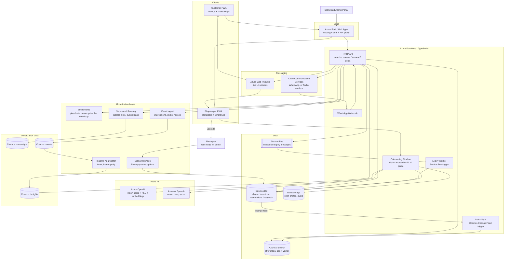
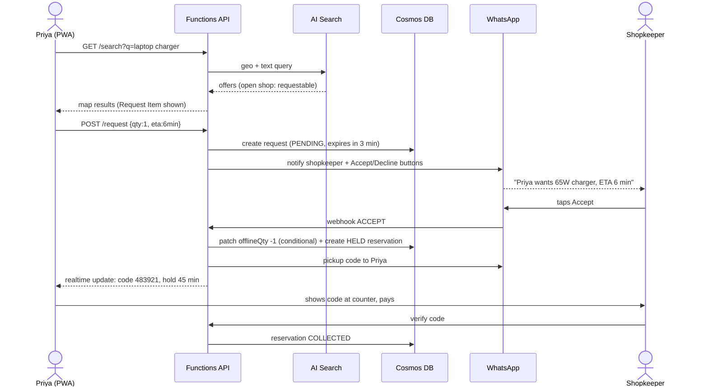
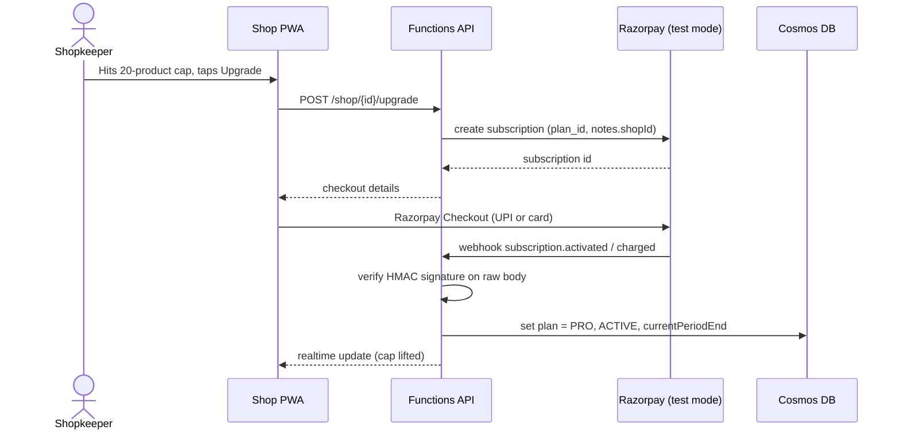
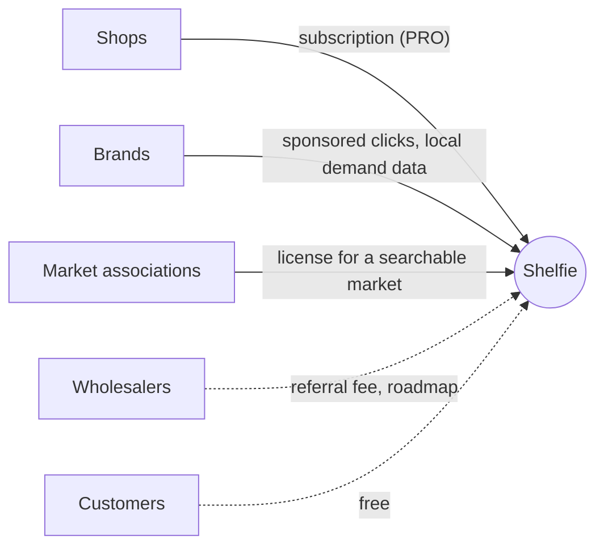

# Shelfie: Implementation Plan

Live local availability, reserved in one tap. Dual-pool inventory ("Smart Buffer") with a Request Item conversion flow.

---

## 0. Honest Verdict (read this first)

**Is it hackathon-winning material? It can be, but not as written. The idea is good; the pitch has holes; execution decides everything.**

| Dimension | Score /10 | Why |
|---|---|---|
| Problem clarity | 8 | Everyone has made a wasted trip. Instantly relatable. |
| Originality | 5 | "See what's in stock nearby" is not new (Google local inventory, Blinkit/Zepto, ONDC, reserve-and-collect apps). The dual-pool + Request Item mechanic is the only genuinely new part. |
| Technical depth | 5 on paper, 8 if built well | The doc lists Azure services, which reads as a shopping list. Depth comes from concurrency-safe reservations, expiry, and the pool-conversion transaction. |
| Feasibility in a hackathon | 7 | Doable in 24-48h if scoped hard. WhatsApp Business API is the biggest time risk. |
| Business viability | 4 now, 6-7 achievable | The original doc had no answer to "why will shopkeepers do this daily?" or "how does it make money?" Sections 4B and 8B now give a model and the architecture for it, but it only counts once it is backed by real shopkeeper conversations and a pilot. |
| Demo-ability | 9 | The Priya story is a perfect live demo, with two phones on stage. |

**Honest odds** (my judgment, not data): with a working live demo of the full Request flow plus real shop data, you are plausibly a top-3 contender at a typical college or Azure-themed hackathon. With slides only, you are mid-pack, because dozens of teams will pitch "Azure + map + AI".

### Strengths
1. The Smart Buffer reframes the hardest problem (stale inventory) as a constraint instead of trying to solve it. That is a smart pitch.
2. Request Item turns "Out of stock" into a captured sale. It is the best idea in the document.
3. Zero-install web app plus WhatsApp matches how small Indian shopkeepers actually work.

### Weaknesses judges WILL probe

1. **Internal contradiction in your doc.** It says the offline pool "never needs an app update when sold", but the example says "a walk-in customer buys a unit: the shopkeeper updates manually." Which is it? Fix the wording: *offline sales never touch the online pool and need no update. The shopkeeper only re-balances pools occasionally.* The offline count is then deliberately approximate.
2. **The accuracy problem is moved, not solved.** The physical units are the same units. If the shopkeeper sells an "online" unit to a walk-in, the reservation is a lie. You need an answer: physical set-aside shelf or bin, "reserved" tags, and a **no-fault fallback** (if the item is gone at pickup, the shopkeeper taps "Not available", the customer is auto-routed to the next shop, and the shop's reliability score drops).
3. **Two-sided cold start.** A map with 2 shops is useless. Answer: onboard a dense cluster (one street or campus-adjacent area) and demo that, not "the city".
4. **Why not just integrate with billing/POS apps** (Khatabook, Vyapar, Zoho)? That is the real long-term fix. Pitch the dual-pool as the zero-integration wedge and POS/CSV/barcode sync as the roadmap.
5. **No-shows.** Holds of 30-60 min can be abused. You need a customer trust score.
6. **Monetization is missing.** Options: free for shops plus a promoted-listing fee, a small per-pickup fee, or a SaaS tier for demand analytics.
7. **Competitors.** Be ready to say why you beat Google Maps (no live stock, no reservation) and quick-commerce (fees, dark-store inventory, not neighbourhood shops).

### What would move you from "good" to "winner"
- Run the **full Priya flow live** with real WhatsApp and a real second phone.
- Show **real data**: 8-15 actual shops near campus with real products. Judges can tell when data is fake.
- Add **one or two differentiators** from Section 6 (voice onboarding in Kannada/Hindi plus the demand heatmap are the best value for effort).
- Present a **numbers slide**: pickup success rate, hold-to-collect conversion, request-accept rate from your pilot with even 3 shops.

---

## 1. Scope Strategy (incremental, validate each layer)

Build in layers. Do not start the next layer until the current one is verified.

| Phase | Goal | Validation gate |
|---|---|---|
| 1. Data + search | Shops, products, inventory in Cosmos; search with geo-filter | Searching "charger" near a lat/lng returns the right shops in distance order |
| 2. Map UI | Results on Azure Maps with price, distance, walk time, freshness | You can see all fields on a phone browser |
| 3. Reserve + expire | Atomic reserve, pickup code, expiry release | 20 parallel reserve calls on 1 unit yield exactly 1 success |
| 4. Shopkeeper dashboard | Set pools, mark sale, confirm pickup | Pool changes show in search within ~5s |
| 5. Request Item | Request, notify, accept/decline/expire | Accept moves units with no double-sell; decline shows the next shop |
| 6. Notifications | WhatsApp (or fallback) | Shopkeeper accepts from a phone with one tap |
| 7. Onboarding AI | Photo/voice stock setup | A 10-item shelf photo becomes 8+ correct items |
| 8. Differentiators + demo polish | Section 6 features | Rehearsed 3-minute demo with no failures |
| 9. Monetization layer (minimal) | Plans and limits, labeled sponsored slot, event logging, insights, billing in test mode (Section 4B) | A free shop hits the 20-product cap, upgrades (test or clearly labeled simulated), and the cap lifts; a ₹50 campaign at ₹5 per click is charged exactly 10 times even under 20 parallel clicks; an insight with fewer than 5 unique users is not published |

Must-have for demo: Phases 1-6, plus the minimal version of Phase 9. Phases 7-8 are what win.

---

## 2. High-Level Architecture



**Money flows and data flows are separate from the reserve path.** Reservations, requests, accepts and pickups never wait on billing, ranking or analytics. The monetization layer only reads events and re-orders search results.

**Key design principles**
1. **Cosmos DB is the single source of truth.** Search is a derived read model, fed by the change feed.
2. **All inventory mutations are atomic and conditional.** Never read-modify-write blindly.
3. **Expiry is event-driven** (Service Bus scheduled messages) with a sweeper as a safety net.
4. **Search can be stale; reserve cannot.** The reserve API always re-checks Cosmos, never trusts the search index.

---

## 3. Tech Stack

| Layer | Choice | Why / note |
|---|---|---|
| Frontend | Next.js (App Router) + TypeScript + Tailwind, as a PWA | Zero-install, works on any phone. Use `next-pwa` or a manifest plus service worker. |
| Map | Azure Maps Web SDK (`azure-maps-control`) | Markers, clustering, pedestrian route for walking time. |
| Hosting | Azure Static Web Apps | Free tier, built-in API proxy to Functions. |
| API | Azure Functions v4 (Node 20, TypeScript) | HTTP triggers plus Service Bus plus Cosmos change-feed triggers in one project. |
| Database | Azure Cosmos DB (NoSQL, serverless) | Partition key `/shopId`. Transactional batch and conditional patch work within a partition. |
| Search | Azure AI Search (Free or Basic) | `geo.distance` filter, fuzzy/typo tolerance, optional vector field for substitutes. |
| Timers | Azure Service Bus (scheduled messages) | Exact-time expiry per hold. Cheaper and more precise than polling. |
| Realtime | Azure Web PubSub (or SignalR Service) | Push stock/hold/request updates to both apps. |
| Messaging | Azure Communication Services Advanced Messaging (WhatsApp) | **Fallback: Twilio WhatsApp sandbox** for the hackathon. Meta business verification and template approval take days. |
| Vision | Azure OpenAI vision (GPT-4o class) plus browser barcode scan | Photo to structured JSON is far better than raw OCR. Barcode lookup via Open Food Facts for packaged goods. |
| Speech | Azure AI Speech (`kn-IN`, `hi-IN`, `en-IN`) plus Azure OpenAI to parse | "Fifty Maggi packets at fourteen rupees, twenty online" to JSON. |
| Invoice parsing (Section 6B #4) | Azure AI Document Intelligence (prebuilt invoice model) | Extracts line items from supplier bills; more reliable than a raw vision prompt on printed invoices. |
| Subscriptions (Section 4B) | Razorpay Subscriptions (test mode for the demo) | Recurring billing for the shop PRO plan, with UPI/card mandates; confirm current API details in Razorpay's docs. Azure has no payment gateway of its own. |
| Event store + insights (Section 4B) | Cosmos DB `events` and `insights` containers, timer-triggered aggregator | Enough at hackathon scale. At real scale move to Event Hubs plus Stream Analytics or Microsoft Fabric. |
| Area bucketing | `ngeohash` (precision 6, roughly 1 km cells) | Lets you aggregate demand by neighbourhood without storing exact customer locations. |
| Brand / admin portal | Extra routes in the same Next.js app (`/brand`, `/admin`) | Campaign creation, budget view, aggregated demand, bulk shop import. |
| Dashboards (optional) | Simple charts in the app; Power BI Embedded only if you have spare time | Do not spend hackathon hours on BI tooling. |
| Auth | Customer: phone OTP or anonymous plus phone. Shopkeeper: magic link via WhatsApp. | Keep auth light; do not spend hackathon hours here. |
| Secrets | Azure Key Vault or Functions app settings | |
| Observability | Application Insights | Useful for the demo ("look at the live trace"). |
| IaC (optional) | Bicep | Only if time permits. |

---

## 4. Low-Level Architecture

### 4.1 Repository layout

```
shelfie/
  apps/
    web/                    # Next.js PWA (customer + shopkeeper routes)
      app/(customer)/search/page.tsx
      app/(customer)/reservation/[id]/page.tsx
      app/(shop)/dashboard/page.tsx
      app/(shop)/onboard/page.tsx
      lib/maps.ts  lib/api.ts  lib/realtime.ts
  api/                      # Azure Functions
    src/functions/
      search.ts reserve.ts request.ts respond.ts pools.ts
      pickup.ts walkin.ts whatsappWebhook.ts
      expiryWorker.ts indexSync.ts onboard.ts
    src/lib/
      cosmos.ts inventory.ts codes.ts search.ts notify.ts
      sb.ts pubsub.ts schemas.ts
  infra/                    # Bicep (optional)
  scripts/seed.ts           # load real shops/products
```

### 4.2 Data model (Cosmos DB, one database `shelfie`)

All containers use partition key `/shopId`, so a shop's inventory, reservations, and requests live together and can be updated in one transaction.

**`shops`**
```json
{
  "id": "shop_123", "shopId": "shop_123",
  "name": "Sri Ganesh Electronics",
  "location": { "type": "Point", "coordinates": [77.5946, 12.9716] },
  "phone": "+91XXXXXXXXXX", "whatsapp": "+91XXXXXXXXXX",
  "hours": { "mon": ["09:00","21:30"], "tue": ["09:00","21:30"] },
  "reliability": 0.92,
  "defaultHoldMinutes": 45
}
```

**`inventory`** (one doc per shop+product)
```json
{
  "id": "inv_shop_123_prod_77", "shopId": "shop_123",
  "productId": "prod_77", "name": "65W Laptop Charger (Dell)",
  "category": "electronics", "price": 1299,
  "onlineQty": 50, "offlineQty": 50,
  "lastUpdated": "2026-10-04T15:30:00Z",
  "lastVerified": "2026-10-04T15:30:00Z",
  "unmetRequests7d": 4
}
```

**`reservations`**
```json
{
  "id": "res_abc", "shopId": "shop_123", "inventoryId": "inv_shop_123_prod_77",
  "customerPhone": "+91...", "qty": 1,
  "status": "HELD",
  "source": "ONLINE_POOL",
  "pickupCode": "483921",
  "createdAt": "...", "expiresAt": "...",
  "ttl": 604800
}
```
Status machine: `HELD -> COLLECTED | EXPIRED | CANCELLED | SHOP_UNABLE`

**`requests`** (Request Item)
```json
{
  "id": "req_xyz", "shopId": "shop_123", "inventoryId": "...",
  "customerPhone": "+91...", "qty": 1, "etaMinutes": 10,
  "status": "PENDING", "expiresAt": "...", "ttl": 86400
}
```
Status machine: `PENDING -> ACCEPTED | DECLINED | EXPIRED`. On accept, a `reservation` with `source: "OFFLINE_CONVERTED"` is created.

### 4.3 Azure AI Search index: `offers`

One document per (shop, product), synced from `inventory` + `shops` via the change feed.

| Field | Type | Attributes |
|---|---|---|
| `id` | Edm.String | key |
| `shopId`, `productId` | Edm.String | filterable |
| `name` | Edm.String | searchable (analyzer `en.microsoft`), plus a `synonyms` map |
| `category` | Edm.String | filterable, facetable |
| `price` | Edm.Double | filterable, sortable |
| `inStock` | Edm.Boolean | filterable (`onlineQty > 0`) |
| `requestable` | Edm.Boolean | filterable (`onlineQty == 0 && offlineQty > 0`, **shown but you may hide the exact offline count**) |
| `location` | Edm.GeographyPoint | filterable, sortable |
| `openNow` | Edm.Boolean | refreshed by a timer function every 5 min |
| `closesAt` | Edm.DateTimeOffset | |
| `lastUpdated` | Edm.DateTimeOffset | sortable |
| `embedding` | Collection(Edm.Single) | vector (optional, for substitutes) |

Sample query:
```
search=charger~
$filter=geo.distance(location, geography'POINT(77.5946 12.9716)') le 2 and (inStock eq true or requestable eq true)
$orderby=geo.distance(location, geography'POINT(77.5946 12.9716)')
```
Ranking modes: closest (`geo.distance`), cheapest (`price asc`), open now (`openNow eq true`, then distance). Walk time: call the Azure Maps Route Matrix with `travelMode=pedestrian` for the top ~10 results only.

### 4.4 API surface

| Method + path | Purpose |
|---|---|
| `GET /api/search?q=&lat=&lng=&radius=&sort=` | Query the index, enrich with walk time and freshness |
| `POST /api/reserve` `{inventoryId, shopId, qty, phone}` | Atomic reserve from the online pool |
| `POST /api/reserve/{id}/cancel` | Customer cancels, unit returns to online pool |
| `POST /api/request` `{inventoryId, shopId, qty, etaMinutes, phone}` | Create a Request Item |
| `POST /api/request/{id}/respond` `{decision}` | Shopkeeper accepts or declines |
| `POST /api/shop/{shopId}/pools` `{inventoryId, onlineQty, offlineQty}` | Re-balance pools |
| `POST /api/shop/{shopId}/walkin` `{inventoryId, qty}` | Optional quick "-1 offline" tap |
| `POST /api/pickup/verify` `{shopId, code}` | Shopkeeper verifies code, marks `COLLECTED` |
| `POST /api/shop/{shopId}/onboard/photo` / `/voice` | AI onboarding |
| `POST /api/whatsapp/webhook` | Inbound WhatsApp replies (ACCEPT/DECLINE buttons) |

### 4.5 The critical piece: atomic reserve

Concurrency is the heart of the project. Use Cosmos DB **conditional patch**, which is atomic server-side and cannot oversell.

```ts
// api/src/lib/inventory.ts
import { CosmosClient } from "@azure/cosmos";
import { randomInt } from "crypto";

const client = new CosmosClient(process.env.COSMOS_CONN!);
const db = client.database("shelfie");
const inventory = db.container("inventory");
const reservations = db.container("reservations");

export async function reserveFromOnlinePool(args: {
  shopId: string; inventoryId: string; qty: number;
  phone: string; holdMinutes: number;
}) {
  const { shopId, inventoryId, qty, phone, holdMinutes } = args;
  if (!Number.isInteger(qty) || qty < 1 || qty > 5) throw new Error("INVALID_QTY");

  // 1) Atomic conditional decrement. Fails (412) if not enough stock.
  try {
    await inventory.item(inventoryId, shopId).patch({
      condition: `from c where c.onlineQty >= ${qty}`,
      operations: [
        { op: "incr", path: "/onlineQty", value: -qty },
        { op: "set", path: "/lastUpdated", value: new Date().toISOString() },
      ],
    });
  } catch (e: any) {
    if (e.code === 412) throw new Error("OUT_OF_STOCK");
    throw e;
  }

  // 2) Create the hold. If this fails, compensate.
  const now = Date.now();
  const res = {
    id: `res_${crypto.randomUUID()}`,
    shopId, inventoryId, customerPhone: phone, qty,
    status: "HELD", source: "ONLINE_POOL",
    pickupCode: String(randomInt(100000, 999999)),
    createdAt: new Date(now).toISOString(),
    expiresAt: new Date(now + holdMinutes * 60_000).toISOString(),
    ttl: 7 * 24 * 3600,
  };
  try {
    await reservations.items.create(res);
  } catch (e) {
    await inventory.item(inventoryId, shopId).patch([
      { op: "incr", path: "/onlineQty", value: qty },
    ]);
    throw e;
  }

  // 3) Schedule the expiry (see 4.6)
  await scheduleExpiry(res.id, shopId, new Date(res.expiresAt));
  return res;
}
```

Validate with a concurrency test (Phase 3 gate):
```ts
// scripts/race.ts: 20 parallel reserves on a doc with onlineQty=1
const results = await Promise.allSettled(
  Array.from({ length: 20 }, (_, i) =>
    reserveFromOnlinePool({ shopId, inventoryId, qty: 1, phone: `+91000000${i}`, holdMinutes: 30 }))
);
console.log(results.filter(r => r.status === "fulfilled").length); // must print 1
```

### 4.6 Hold expiry (idempotent)

On reserve, enqueue a Service Bus message with `scheduledEnqueueTimeUtc = expiresAt`. The worker must be safe to run twice.

```ts
// api/src/functions/expiryWorker.ts
import { app } from "@azure/functions";
import { CosmosClient } from "@azure/cosmos";

const db = new CosmosClient(process.env.COSMOS_CONN!).database("shelfie");

app.serviceBusQueue("expiryWorker", {
  connection: "SB_CONN", queueName: "hold-expiry",
  handler: async (msg: any) => {
    const { reservationId, shopId } = msg;
    const resItem = db.container("reservations").item(reservationId, shopId);
    let r: any;
    try {
      // Only flips HELD -> EXPIRED; no-op if already COLLECTED/CANCELLED
      ({ resource: r } = await resItem.patch({
        condition: `from c where c.status = 'HELD'`,
        operations: [{ op: "set", path: "/status", value: "EXPIRED" }],
      }));
    } catch (e: any) { if (e.code === 412) return; throw e; }

    // Return the unit to the pool it came from
    const field = r.source === "ONLINE_POOL" ? "/onlineQty" : "/offlineQty";
    await db.container("inventory").item(r.inventoryId, shopId)
      .patch([{ op: "incr", path: field, value: r.qty }]);
  },
});
```
Safety net: a timer function every 2 min that finds `status='HELD' AND expiresAt < now` and enqueues them again. Because the handler is idempotent, duplicates are harmless.

**Design decision to state in your pitch:** when a hold converted from the offline pool expires, return the unit to the **offline** pool, not online. The shopkeeper explicitly opened it for that one customer.

### 4.7 Request Item: accept transaction

On accept, **do not** move units into the online pool and then reserve. That leaves a window where another app user can grab them. Move directly from offline to held in one step:

```ts
// respond.ts (accept path)
await inventory.item(req.inventoryId, shopId).patch({
  condition: `from c where c.offlineQty >= ${req.qty}`,
  operations: [{ op: "incr", path: "/offlineQty", value: -req.qty }],
}); // 412 => "No longer available", auto-decline
// then create reservation { source: "OFFLINE_CONVERTED", status: "HELD" }
// guard the request with a conditional patch: only PENDING -> ACCEPTED
```
Guard the request itself: `condition: from c where c.status = 'PENDING'` so a double-tap or late timeout cannot accept it twice.

### 4.8 Sequence: Priya's flow


Decline path: `API` queries Search again excluding that shop and pushes the next-nearest option to Priya.

### 4.9 Notifications and the WhatsApp reality check

- **Production path:** Azure Communication Services Advanced Messaging (WhatsApp) with approved templates and interactive buttons (Accept / Decline).
- **Hackathon path:** Twilio WhatsApp sandbox (works in minutes; the shopkeeper's phone joins the sandbox). Mention in the pitch that production uses an approved WhatsApp Business number.
- **Fallback that always works:** the shopkeeper PWA with Web Push plus a looping alert sound on the dashboard. Build this first; it is your demo insurance if WhatsApp misbehaves.
- Reply parsing: the buttons send payloads like `ACCEPT:req_xyz`; verify the webhook signature.

### 4.10 Security and abuse controls

- Verify webhook signatures; validate all inputs with Zod.
- Per-phone rate limit on reserves (e.g. max 2 active holds).
- Pickup codes: 6 digits, valid only for that shop, single use, checked server-side with the shop ID.
- Customer trust score: no-shows reduce the allowed hold time, or require an extra confirmation.
- Never expose `offlineQty` to customers. Expose only the boolean `requestable`.

### 4.11 Onboarding pipeline (Phase 7)

1. **Photo:** shopkeeper snaps a shelf. Function sends it to Azure OpenAI vision with a strict JSON schema: `[{name, brand, size, approxQty, confidence}]`.
2. **Barcode (optional):** in-browser `BarcodeDetector` or `@zxing/browser` scan, then product lookup (Open Food Facts for packaged goods).
3. **Review screen:** the shopkeeper confirms or edits, sets price, and moves a slider for the online/offline split (default 50/50).
4. **Voice:** Azure AI Speech transcribes (Kannada/Hindi/English), then the LLM parses into the same JSON.
5. Write to `inventory`; the change feed updates search.

Always include a human confirmation step. Do not auto-publish AI output.

---

## 4B. Monetization Layer: Low-Level Design

### Design rules

1. **Never gate or slow the core loop.** Reserving, Request Item, accept/decline, and pickup verification work identically on every plan. The core loop is what creates shop density, and density is what creates revenue.
2. **Money features read events; they never sit in the reserve path.** If billing, ranking, or analytics fail, reservations still work.
3. **Sponsored results are always labeled and never override relevance.** Only offers that actually match the search, are open, and are in stock can be promoted.
4. **Aggregate before sharing.** Brands see only aggregated demand with a minimum number of unique users. Phone numbers are hashed and never exposed.
5. **Label simulations as simulations.** If you fake a payment for the demo, the UI says "Simulated payment (demo mode)".

### Data model additions

**`shops` additions**
```json
{
  "areaId": "tdr1vq",
  "tenantId": null,
  "plan": {
    "id": "FREE",
    "status": "ACTIVE",
    "currentPeriodEnd": null,
    "razorpaySubscriptionId": null
  }
}
```
`areaId` is a geohash cell (precision 6, roughly 1 km). `tenantId` is set when a shop is onboarded through a market association.

**`campaigns`** (partition key `/brandId`)
```json
{
  "id": "camp_001", "brandId": "brand_dell",
  "productKeys": ["dell 65w charger"],
  "areaIds": ["tdr1vq", "tdr1vr"],
  "costPerClickINR": 5,
  "budgetINR": 50, "remainingINR": 50,
  "status": "ACTIVE",
  "startAt": "2026-10-10T00:00:00Z", "endAt": "2026-10-17T00:00:00Z"
}
```

**`events`** (partition key `/areaId`, TTL 90 days; no raw phone numbers)
```json
{
  "id": "evt_...", "areaId": "tdr1vq",
  "type": "SEARCH_MISS",
  "productKey": "dell 65w charger",
  "shopId": null, "campaignId": null,
  "userKey": "9f2c...",
  "ts": "2026-10-04T15:30:00Z", "ttl": 7776000
}
```
Event types: `SEARCH`, `SEARCH_MISS`, `IMPRESSION`, `CLICK`, `REQUEST`, `REQUEST_UNMET`, `RESERVE`, `PICKUP`, `WATCH`.

**`insights`** (partition key `/areaId`, written only by the aggregator)
```json
{
  "id": "tdr1vq|dell 65w charger|7d", "areaId": "tdr1vq",
  "productKey": "dell 65w charger", "windowDays": 7,
  "uniqueUsers": 17, "misses": 21, "requests": 9, "watches": 4,
  "updatedAt": "2026-10-04T16:00:00Z"
}
```

### API additions

| Method + path | Who | Purpose |
|---|---|---|
| `POST /api/shop/{shopId}/upgrade` | Shop | Create a Razorpay subscription; returns checkout details |
| `POST /api/billing/razorpay` | Razorpay | Webhook; updates `shops.plan` |
| `POST /api/dev/simulate-upgrade` | Demo only | Flips the plan when `DEMO_MODE=true`; the UI must show a "simulated" banner |
| `POST /api/sponsored/click` `{campaignId, offerId, sessionId}` | Customer app | Idempotent click charge |
| `POST /api/brand/campaigns` / `GET /api/brand/campaigns/{id}` | Brand portal | Create and view campaigns |
| `GET /api/insights/shop/{shopId}` | Shop | Own unmet demand; depth depends on plan |
| `GET /api/insights/brand?productKey=&areaIds=` | Brand portal | Aggregated demand, only rows with enough unique users |
| `POST /api/admin/shops/import` (CSV) | Association admin | Bulk onboarding under a `tenantId` |

New files in the Functions project:
```
api/src/lib/entitlements.ts   api/src/lib/ranking.ts   api/src/lib/events.ts
api/src/lib/campaigns.ts      api/src/functions/razorpayWebhook.ts
api/src/functions/insightsAggregator.ts   api/src/functions/upgrade.ts
```

### Entitlements (plan limits)

Only limits that do not touch the core loop:

```ts
// api/src/lib/entitlements.ts
export type PlanId = "FREE" | "PRO" | "ASSOCIATION";

export interface PlanLimits {
  maxProducts: number;
  insights: "BASIC" | "FULL";
  sponsoredEligible: boolean;       // shop can be featured in paid placements
  requestRoutingTiebreak: boolean;  // wins ties only; never skips better-scored shops
}

export const PLANS: Record<PlanId, PlanLimits> = {
  FREE:        { maxProducts: 20,   insights: "BASIC", sponsoredEligible: false, requestRoutingTiebreak: false },
  PRO:         { maxProducts: 1000, insights: "FULL",  sponsoredEligible: true,  requestRoutingTiebreak: true  },
  ASSOCIATION: { maxProducts: 1000, insights: "FULL",  sponsoredEligible: true,  requestRoutingTiebreak: true  },
};

export interface ShopPlan {
  id: PlanId;
  status: "ACTIVE" | "PAST_DUE" | "CANCELLED";
  currentPeriodEnd: string | null;
}

/** A paid plan only counts while ACTIVE and not past its period end. Otherwise fall back to FREE. */
export function effectivePlan(plan: ShopPlan | undefined, now = new Date()): PlanId {
  if (!plan || plan.id === "FREE") return "FREE";
  if (plan.status !== "ACTIVE") return "FREE";
  if (plan.currentPeriodEnd && new Date(plan.currentPeriodEnd) < now) return "FREE";
  return plan.id;
}

export class PlanLimitError extends Error {
  status = 402;
  constructor(public limit: string, public planId: PlanId) {
    super(`PLAN_LIMIT:${limit}`);
  }
}

/** Call from the inventory create/import/onboarding-publish paths only. */
export function assertCanAddProducts(plan: ShopPlan | undefined, currentCount: number, adding: number) {
  const id = effectivePlan(plan);
  const max = PLANS[id].maxProducts;
  if (currentCount + adding > max) throw new PlanLimitError("maxProducts", id);
}
```
The client turns a `402 PLAN_LIMIT` into an upgrade prompt. If a paid plan lapses, existing products stay visible (do not delete data); the shop just cannot add more beyond the free cap.

### Event logging

```ts
// api/src/lib/events.ts
import { CosmosClient } from "@azure/cosmos";
import crypto from "crypto";
import geohash from "ngeohash";

const db = new CosmosClient(process.env.COSMOS_CONN!).database("shelfie");
export const events = db.container("events"); // partition key /areaId

export type EventType =
  | "SEARCH" | "SEARCH_MISS" | "IMPRESSION" | "CLICK"
  | "REQUEST" | "REQUEST_UNMET" | "RESERVE" | "PICKUP" | "WATCH";

const hashPhone = (phone: string) =>
  crypto.createHmac("sha256", process.env.PHONE_HASH_SECRET!).update(phone).digest("hex").slice(0, 32);

/**
 * Pass the CUSTOMER's coordinates for SEARCH, SEARCH_MISS, WATCH, REQUEST.
 * Pass the SHOP's coordinates for IMPRESSION, CLICK, PICKUP so dedupe keys land in the same partition.
 * Returns false if a dedupeKey already exists (duplicate event).
 */
export async function logEvent(e: {
  type: EventType; lat: number; lng: number;
  productKey?: string; shopId?: string; campaignId?: string;
  sessionId: string; phone?: string; dedupeKey?: string;
}): Promise<boolean> {
  const areaId = geohash.encode(e.lat, e.lng, 6);
  try {
    await events.items.create({
      id: e.dedupeKey ?? crypto.randomUUID(),
      areaId, type: e.type,
      productKey: e.productKey, shopId: e.shopId, campaignId: e.campaignId,
      userKey: e.phone ? hashPhone(e.phone) : e.sessionId,
      ts: new Date().toISOString(),
      ttl: 90 * 24 * 3600,
    });
    return true;
  } catch (err: any) {
    if (err.code === 409) return false;
    throw err;
  }
}
```
Log events with fire-and-forget (`void logEvent(...).catch(console.error)`) so analytics can never slow or break a search or reservation.

### Sponsored ranking (labeled, relevance-first)

```ts
// api/src/lib/ranking.ts
export interface Offer {
  shopId: string; inventoryId: string; name: string; productKey: string;
  price: number; distanceM: number;
  inStock: boolean; requestable: boolean; openNow: boolean;
  sponsored?: { campaignId: string };
}

export interface Campaign {
  id: string; brandId: string; productKeys: string[]; areaIds: string[];
  costPerClickINR: number; remainingINR: number;
  status: "ACTIVE" | "PAUSED" | "ENDED"; startAt: string; endAt: string;
}

/**
 * Promote at most ONE offer, and only if it:
 *  - is already in the organic results (matches the search),
 *  - is open and in stock (not merely requestable),
 *  - is no more than maxExtraDistanceM farther than the nearest organic result,
 *  - belongs to an active campaign with budget left.
 * Everything else keeps its organic order. The promoted offer is flagged for a "Sponsored" label.
 */
export function applySponsoredSlot(
  organic: Offer[],
  campaigns: Campaign[],
  now = new Date(),
  maxExtraDistanceM = 500,
): Offer[] {
  if (organic.length === 0) return organic;
  const nearest = Math.min(...organic.map(o => o.distanceM));

  const live = campaigns.filter(c =>
    c.status === "ACTIVE" &&
    c.remainingINR >= c.costPerClickINR &&
    new Date(c.startAt) <= now && now <= new Date(c.endAt));

  let best: { offer: Offer; campaign: Campaign } | null = null;
  for (const o of organic) {
    if (!o.openNow || !o.inStock) continue;
    if (o.distanceM > nearest + maxExtraDistanceM) continue;
    const c = live.find(c => c.productKeys.includes(o.productKey));
    if (!c) continue;
    if (!best || o.distanceM < best.offer.distanceM) best = { offer: o, campaign: c };
  }
  if (!best) return organic;

  const promoted: Offer = { ...best.offer, sponsored: { campaignId: best.campaign.id } };
  return [promoted, ...organic.filter(o => o.inventoryId !== best!.offer.inventoryId)];
}
```
Only shops on a plan with `sponsoredEligible` should be promotable: filter organic offers by shop plan before calling this, or tag offers during enrichment.

Log an `IMPRESSION` event only when a sponsored offer is actually shown.

### Click charging (idempotent and budget-safe)

```ts
// api/src/lib/campaigns.ts
import { CosmosClient } from "@azure/cosmos";
import { logEvent } from "./events";

const db = new CosmosClient(process.env.COSMOS_CONN!).database("shelfie");
const campaigns = db.container("campaigns");

/** Returns true if this click was charged; false if duplicate or budget exhausted. */
export async function chargeSponsoredClick(args: {
  campaignId: string; brandId: string; costPerClickINR: number;
  sessionId: string; shopLat: number; shopLng: number; shopId: string; productKey: string;
}): Promise<boolean> {
  const { campaignId, brandId, costPerClickINR: cost, sessionId } = args;

  // 1) Dedupe: one chargeable click per session per campaign per 10-minute bucket.
  const bucket = Math.floor(Date.now() / (10 * 60_000));
  const fresh = await logEvent({
    type: "CLICK", lat: args.shopLat, lng: args.shopLng,
    shopId: args.shopId, productKey: args.productKey, campaignId,
    sessionId, dedupeKey: `click_${campaignId}_${sessionId}_${bucket}`,
  });
  if (!fresh) return false;

  // 2) Atomic budget decrement. Fails (412) once the budget cannot cover another click.
  try {
    await campaigns.item(campaignId, brandId).patch({
      condition: `from c where c.status = 'ACTIVE' and c.remainingINR >= ${cost}`,
      operations: [{ op: "incr", path: "/remainingINR", value: -cost }],
    });
    return true;
  } catch (e: any) {
    if (e.code === 412) return false;
    throw e;
  }
}
```
Validation gate: a campaign with `remainingINR: 50` and `costPerClickINR: 5`, hit by 20 parallel clicks from 20 different sessions, must end with exactly 10 charged clicks and `remainingINR: 0`. If your SDK version rejects the patch condition, test it on a throwaway document first; the pattern matches the reservation patches in Section 4.5.

### Insights aggregator (with a minimum-audience rule)

```ts
// api/src/functions/insightsAggregator.ts
import { app } from "@azure/functions";
import { CosmosClient } from "@azure/cosmos";

const db = new CosmosClient(process.env.COSMOS_CONN!).database("shelfie");
const events = db.container("events");
const insights = db.container("insights");

const WINDOW_DAYS = 7;
const K_MIN = 5; // never publish a row backed by fewer than 5 unique users

app.timer("insightsAggregator", {
  schedule: "0 */30 * * * *", // every 30 minutes
  handler: async () => {
    const since = new Date(Date.now() - WINDOW_DAYS * 86_400_000).toISOString();
    const { resources } = await events.items.query({
      query: `SELECT c.type, c.areaId, c.productKey, c.userKey FROM c
              WHERE c.ts >= @since AND c.productKey != null
              AND c.type IN ('SEARCH_MISS','REQUEST','REQUEST_UNMET','WATCH')`,
      parameters: [{ name: "@since", value: since }],
    }).fetchAll();

    type G = { areaId: string; productKey: string; users: Set<string>;
               misses: number; requests: number; watches: number };
    const groups = new Map<string, G>();

    for (const r of resources) {
      const key = `${r.areaId}|${r.productKey}`;
      const g = groups.get(key) ?? { areaId: r.areaId, productKey: r.productKey,
        users: new Set<string>(), misses: 0, requests: 0, watches: 0 };
      g.users.add(r.userKey);
      if (r.type === "SEARCH_MISS" || r.type === "REQUEST_UNMET") g.misses++;
      if (r.type === "REQUEST") g.requests++;
      if (r.type === "WATCH") g.watches++;
      groups.set(key, g);
    }

    for (const g of groups.values()) {
      if (g.users.size < K_MIN) continue; // too few people: do not publish
      await insights.items.upsert({
        id: `${g.areaId}|${g.productKey}|${WINDOW_DAYS}d`,
        areaId: g.areaId, productKey: g.productKey, windowDays: WINDOW_DAYS,
        uniqueUsers: g.users.size, misses: g.misses, requests: g.requests, watches: g.watches,
        updatedAt: new Date().toISOString(),
      });
    }
  },
});
```
At hackathon scale, aggregating in code is fine and simple. At real scale, move to Event Hubs plus Stream Analytics or Fabric.

Insights access rules:
- **Shops** see their own unmet demand (their `REQUEST_UNMET` events and misses near their `areaId`). FREE sees the top 3 products; PRO sees everything.
- **Brands** only ever read `insights` rows (already filtered by `K_MIN`), never raw events.

### Billing (Razorpay subscriptions)

Flow:


Webhook handler (signature check on the raw body, then an idempotent plan update):
```ts
// api/src/functions/razorpayWebhook.ts
import { app, HttpRequest, HttpResponseInit } from "@azure/functions";
import { CosmosClient } from "@azure/cosmos";
import crypto from "crypto";

const shops = new CosmosClient(process.env.COSMOS_CONN!).database("shelfie").container("shops");

app.http("razorpayWebhook", {
  methods: ["POST"], authLevel: "anonymous", route: "billing/razorpay",
  handler: async (req: HttpRequest): Promise<HttpResponseInit> => {
    const raw = await req.text();
    const sig = req.headers.get("x-razorpay-signature") ?? "";
    const expected = crypto.createHmac("sha256", process.env.RAZORPAY_WEBHOOK_SECRET!)
      .update(raw).digest("hex");

    const a = Buffer.from(sig), b = Buffer.from(expected);
    if (a.length !== b.length || !crypto.timingSafeEqual(a, b)) return { status: 401 };

    const evt = JSON.parse(raw);
    const sub = evt.payload?.subscription?.entity;
    const shopId: string | undefined = sub?.notes?.shopId;
    if (!shopId) return { status: 200 };

    let plan: { id: string; status: string; currentPeriodEnd: string | null; razorpaySubscriptionId: string } | null = null;
    switch (evt.event) {
      case "subscription.activated":
      case "subscription.charged":
        plan = { id: "PRO", status: "ACTIVE",
                 currentPeriodEnd: sub.current_end ? new Date(sub.current_end * 1000).toISOString() : null,
                 razorpaySubscriptionId: sub.id };
        break;
      case "subscription.halted":
      case "subscription.pending":
        plan = { id: "PRO", status: "PAST_DUE", currentPeriodEnd: null, razorpaySubscriptionId: sub.id };
        break;
      case "subscription.cancelled":
      case "subscription.completed":
        plan = { id: "FREE", status: "CANCELLED", currentPeriodEnd: null, razorpaySubscriptionId: sub.id };
        break;
    }
    if (plan) {
      await shops.item(shopId, shopId).patch([{ op: "set", path: "/plan", value: plan }]);
    }
    return { status: 200 };
  },
});
```
Razorpay's current event names, payload fields, and test-mode setup should be confirmed against their docs when you build this; I have not verified them against the live API. Because the plan update is a plain `set`, replayed webhooks are harmless.

**Demo fallback:** if Razorpay setup eats too much time, use `POST /api/dev/simulate-upgrade` (only when `DEMO_MODE=true`) and show a visible "Simulated payment (demo mode)" banner. Say it out loud in the pitch.

### Market association tenants (go-to-market wiring)

- Add `tenantId` to `shops` and a `tenants` document (`name`, `type`, `shopIds`, `branding`).
- `POST /api/admin/shops/import` takes a CSV (name, phone, lat, lng, hours) and creates shops under the tenant. This is the "sell one deal, onboard a whole street" path, and it is how you beat cold start.
- Search can optionally filter by `tenantId` to power a branded "searchable market" page.

### Restock referral hook (roadmap, interface only)

A timer function can emit `restockSignal` records when a product has repeated `REQUEST_UNMET` events and low stock. In a future version that feed goes to a wholesaler partner for a referral fee. Build only the signal record if you want to show it; do not build the partner integration.

### Privacy and compliance notes

- Opt-in for location, hashed phone numbers in `events`, 90-day TTL, no raw coordinates stored (only a roughly 1 km cell).
- Aggregated brand data requires at least 5 unique users per row.
- You will store phone numbers for reservations; India's data protection law (the DPDP Act) has consent and purpose requirements. Ask a faculty mentor or the club to review before any real launch; for the hackathon, use test numbers only.

---

## 5. Build Order and Time Budget (48-hour version)

| Hours | Work |
|---|---|
| 0-3 | Azure resources, repo, seed 8-15 real shops and ~40 products |
| 3-8 | Phase 1-2: Cosmos, AI Search sync, search API, map UI |
| 8-14 | Phase 3: atomic reserve, codes, expiry; run the race test |
| 14-19 | Phase 4: shopkeeper dashboard (pools, walk-in tap, code verify) |
| 19-26 | Phase 5-6: Request Item, WhatsApp, realtime, decline fallback |
| 26-34 | Phase 7: photo + voice onboarding |
| 34-42 | Differentiators: broadcast request (Section 6B #1), snap to search (#2), cheap extras (#6-#8: rating, accept ranking, impact counter), demo data polish |
| 42-48 | Rehearse, record a backup video, write the pitch, fix bugs only |

If you have 24 hours: skip Phase 7 and do voice onboarding only as a stretch.

**Monetization layer (Section 4B), minimal version: about 6-8 hours.** Build in this order: entitlements and the 20-product cap (1 h), event logging (1 h), sponsored slot plus click charging with its race test (2-3 h), insights aggregator (1 h), billing (2 h, or the labeled simulation in 30 min). Take the time from the differentiator block: if you are short, drop snap-to-search and back-in-stock before you drop this, because this is what the entrepreneurship panel will weigh.

---

## 6. Innovative Features (ranked by value for effort)

1. **Voice onboarding in Kannada/Hindi.** A shopkeeper says "Maggi fifty packets, fourteen rupees, twenty online" and it just works. Strong "this is built for real India" signal and an easy live wow moment.
2. **Demand heatmap and unmet-demand insights.** Every Request Item is a demand signal. Show the shopkeeper: "17 people searched for 65W chargers this week; you had none online." This is also your monetization story (analytics tier).
3. **Auto-suggested pool rebalancing.** Your doc has the text nudge. Make it smarter: forecast demand per product (simple moving average is enough) and suggest "Move 10 units to online" with a one-tap approve.
4. **Freshness confidence score.** Replace "updated 4 mins ago" with a confidence indicator that decays with time and rises with confirming events (successful pickups, recent shopkeeper edits). It directly answers the stale-data objection.
5. **Substitute suggestions via vector search.** If an exact item is unavailable, show "similar charger at 400m", using embeddings in AI Search.
6. **WhatsApp-only shopkeeper mode.** The shopkeeper never opens the dashboard: replies "1" to accept, sends a photo to update stock, sends a voice note to rebalance. Lowest-friction option for tiny shops.
7. **Shop reliability score.** Public badge ("97% of reservations fulfilled"). Creates a healthy incentive and fixes trust.
8. **Multi-item basket at one shop.** "I need a charger and a mouse": find the single closest shop with both and reserve together.
9. **UPI deposit option for high-value items.** Reduces no-shows (stretch goal, mention as roadmap).
10. **Offline-first shopkeeper PWA.** Works on flaky connections and syncs later.

Recommended demo set: **1 + 2 + 4** (plus 6 if WhatsApp works well). The second batch of features, with build details, is in Section 6B; from it, prioritize **broadcast request** and **snap to search**.

---

## 6B. Additional Features (second batch)

### Priority and effort

| # | Feature | Effort | Tier | Build in |
|---|---|---|---|---|
| 1 | Broadcast request | 4-5 h | **Build** | Phase 5 extension |
| 2 | Snap to search | 2-3 h | **Build** | Phase 8 |
| 3 | Back-in-stock alerts | 3 h | Build if time | Phase 8 |
| 4 | Supplier bill scan | 3-4 h | Build if time | Phase 7 |
| 5 | Heads-up when customer is close + dynamic hold | 3 h | Build if time | Phase 8 |
| 6 | One-tap post-pickup rating | 1-2 h | Cheap, build | Phase 6 |
| 7 | Accept-likelihood ranking | 1-2 h | Cheap, build | With #1 |
| 8 | Impact counter | 1-2 h | Cheap, pitch value | Phase 8 |
| 9 | Festival / surge mode | n/a | **Roadmap slide only** | |
| 10 | Google Merchant Center local inventory feed | n/a | **Roadmap slide only** | |

**Rule:** build #1 and #2 on top of the core flow plus your earlier picks (voice onboarding, heatmap, freshness score). Do #6-#8 only because they are cheap. Put #9 and #10 on a roadmap slide; do not build them.

### Data model additions

All existing containers keep partition key `/shopId`. New containers:

**`broadcasts`** (partition key `/broadcastId`; the claim must be one document so exactly one shop can win)
```json
{
  "id": "bc_001", "broadcastId": "bc_001",
  "customerPhone": "+91...", "query": "65W Dell charger", "qty": 1,
  "etaMinutes": 8, "radiusMeters": 1000,
  "status": "OPEN",
  "winnerShopId": null,
  "notifiedShopIds": ["shop_123", "shop_456"],
  "expiresAt": "2026-10-04T21:05:00Z",
  "ttl": 86400
}
```
Status machine: `OPEN -> CLAIMED | EXPIRED`.

**`watches`** (partition key `/phone`, for back-in-stock alerts)
```json
{
  "id": "w_001", "phone": "+91...",
  "queryNormalized": "dell 65w charger", "category": "electronics",
  "location": { "type": "Point", "coordinates": [77.59, 12.97] },
  "radiusMeters": 1500, "createdAt": "...", "ttl": 1209600
}
```

**`shops` additions** (stats used by ranking and reliability)
```json
{
  "stats": {
    "requestsReceived": 24, "requestsAccepted": 17,
    "avgResponseSec": 41,
    "pickupsConfirmed": 40, "pickupsFulfilled": 38
  }
}
```

**`reservations` additions**
```json
{ "nearbyNotified": false, "ratedFulfilled": null, "broadcastId": null, "walkMinutes": 6 }
```

### API additions

| Method + path | Purpose |
|---|---|
| `POST /api/broadcast` `{query, inventoryHint?, qty, etaMinutes, lat, lng, phone}` | Create a broadcast and notify shops |
| `POST /api/broadcast/{id}/respond` `{shopId, inventoryId, decision}` | A shop accepts or declines |
| `POST /api/search/image` (multipart image) | Photo to search query to results |
| `POST /api/watch` `{query, lat, lng, radius, phone}` | Create a back-in-stock watch |
| `POST /api/shop/{shopId}/onboard/invoice` (multipart image/PDF) | Supplier bill to stock draft |
| `POST /api/reservation/{id}/location` `{lat, lng}` | Opt-in location ping for the heads-up |
| `POST /api/reservation/{id}/rate` `{fulfilled}` | Post-pickup rating (also via WhatsApp buttons) |
| `GET /api/impact` | Aggregate impact numbers |

### 1. Broadcast request (race-safe)

**What it does:** when Priya taps Request Item and the nearest shop declines or does not answer, or she simply taps "Ask all nearby shops", the request goes to up to 5 open shops within about 1 km. The first shop to accept wins; the others get "already taken."

**The hard part:** shops live in different Cosmos partitions, so one transaction cannot cover them all. The solution is a single claim document in `broadcasts` (one partition, one document). Whichever shop flips it from `OPEN` to `CLAIMED` first wins, because the conditional patch is atomic.

**Order matters:** take the units from the shop's offline pool **first**, then race for the claim, then undo if you lost. The temporary decrement is on the offline pool, which customers never see, so no one is affected. If you claim first and the inventory patch then fails, other shops have already been told "taken" and you would have to un-claim; that is messier.

```ts
// api/src/lib/broadcast.ts
import { CosmosClient } from "@azure/cosmos";
import { randomInt } from "crypto";

const db = new CosmosClient(process.env.COSMOS_CONN!).database("shelfie");
const inventory = db.container("inventory");
const reservations = db.container("reservations");
const broadcasts = db.container("broadcasts");

type AcceptResult =
  | { ok: true; reservationId: string; pickupCode: string }
  | { ok: false; reason: "NO_STOCK" | "TAKEN" | "EXPIRED" };

export async function acceptBroadcast(args: {
  broadcastId: string; shopId: string; inventoryId: string;
  qty: number; customerPhone: string; holdMinutes: number;
}): Promise<AcceptResult> {
  const { broadcastId, shopId, inventoryId, qty, customerPhone, holdMinutes } = args;

  // 1) Tentatively take units from THIS shop's offline pool (atomic, conditional).
  try {
    await inventory.item(inventoryId, shopId).patch({
      condition: `from c where c.offlineQty >= ${qty}`,
      operations: [{ op: "incr", path: "/offlineQty", value: -qty }],
    });
  } catch (e: any) {
    if (e.code === 412) return { ok: false, reason: "NO_STOCK" };
    throw e;
  }

  // 2) Race for the single claim document. Only one shop can flip OPEN -> CLAIMED.
  try {
    await broadcasts.item(broadcastId, broadcastId).patch({
      condition: `from c where c.status = 'OPEN' and c.expiresAt > '${new Date().toISOString()}'`,
      operations: [
        { op: "set", path: "/status", value: "CLAIMED" },
        { op: "set", path: "/winnerShopId", value: shopId },
      ],
    });
  } catch (e: any) {
    // Lost the race (or it expired): give the units back.
    await inventory.item(inventoryId, shopId).patch([
      { op: "incr", path: "/offlineQty", value: qty },
    ]);
    if (e.code === 412) return { ok: false, reason: "TAKEN" };
    throw e;
  }

  // 3) We won. Create the hold, sourced from the offline pool.
  const now = Date.now();
  const res = {
    id: `res_${crypto.randomUUID()}`,
    shopId, inventoryId, customerPhone, qty,
    status: "HELD", source: "OFFLINE_CONVERTED", broadcastId,
    pickupCode: String(randomInt(100000, 999999)),
    createdAt: new Date(now).toISOString(),
    expiresAt: new Date(now + holdMinutes * 60_000).toISOString(),
    nearbyNotified: false, ratedFulfilled: null,
    ttl: 7 * 24 * 3600,
  };
  try {
    await reservations.items.create(res);
  } catch (e) {
    // Rare: reopen the claim and restore units so another shop can still win.
    await broadcasts.item(broadcastId, broadcastId).patch({
      condition: `from c where c.winnerShopId = '${shopId}'`,
      operations: [
        { op: "set", path: "/status", value: "OPEN" },
        { op: "set", path: "/winnerShopId", value: null },
      ],
    });
    await inventory.item(inventoryId, shopId).patch([
      { op: "incr", path: "/offlineQty", value: qty },
    ]);
    throw e;
  }

  // 4) Side effects (implement with your existing helpers):
  //    - scheduleExpiry(res.id, shopId, new Date(res.expiresAt))   // same worker as normal holds
  //    - notify customer: pickup code + shop name + walk time
  //    - notify the other shops in notifiedShopIds: "Request taken by another shop"
  return { ok: true, reservationId: res.id, pickupCode: res.pickupCode };
}
```

**Choosing which shops to ping:** query the index for open shops within the radius that match the product and are `requestable` or `inStock`, sort by the accept score from feature 7, and take the top 5. Do not blast every shop; notification fatigue kills shopkeeper engagement.

**Broadcast expiry:** schedule a Service Bus message at `expiresAt` (3 minutes). The worker patches `OPEN -> EXPIRED` conditionally, then tells the customer "No shop could confirm. Here are the closest options."

**Validation gate:** fire `acceptBroadcast` from 5 shops at once on the same broadcast, each with 1 offline unit. Exactly one must return `ok: true`, and the other four shops must end with their original `offlineQty`.

### 2. Snap to search

**What it does:** the customer photographs a broken charger, a screw, a medicine strip or a spare part, and Shelfie identifies it and runs the search.

**Build:**
1. Client resizes the image to at most 1024 px before upload (faster and cheaper).
2. `POST /api/search/image` sends it to Azure OpenAI vision with a strict JSON schema:
   `{ "query": "...", "category": "...", "alternates": ["...", "..."], "confidence": 0.0 }`
3. Run the normal search with `query`; on low confidence, show the alternates as chips.
4. Do not store the photo; process it in memory.

**Honest limits:** works well on clear packaged or labelled items; works poorly on generic hardware without markings. Say "identifies likely matches" in the pitch, not "identifies anything".

### 3. Back-in-stock alerts

**What it does:** when a search returns nothing, the customer taps "Notify me" and gets a WhatsApp message when a nearby shop's online pool gets that item.

**Build:**
1. Save a `watches` document (normalized query, location, radius, 14-day TTL).
2. In the existing `indexSync` change-feed function, when an inventory doc goes from `onlineQty = 0` to `> 0`, or a new item appears, look up active watches whose normalized query matches the product name or category and whose location is within the radius of that shop.
3. Send the WhatsApp alert, then delete the watch (one alert per watch).
4. Count unmatched watches as demand signals for the heatmap.

For the hackathon, keyword matching is enough. Use embeddings only if you already have the vector field working.

### 4. Supplier bill scan for onboarding

**What it does:** the shopkeeper photographs a purchase invoice from their supplier; the app extracts items, quantities and prices.

**Build:**
1. Upload to Blob Storage, then call **Azure AI Document Intelligence** with the prebuilt invoice model. It returns line items (description, quantity, unit price). This is more reliable on printed bills than a raw vision prompt.
2. Pass the descriptions through Azure OpenAI to normalize names ("DELL 65W ADPTR 4.5MM" to "Dell 65W Laptop Charger").
3. Show the same review screen as shelf-photo onboarding, with the pool-split slider defaulting to 50/50.
4. The shopkeeper confirms before anything is published.

Add Document Intelligence to the stack table in Section 3 if you build this.

### 5. Heads-up when the customer is close, plus dynamic hold

**What it does:** with the customer's opt-in, the shopkeeper gets a ping when the customer is about 2 minutes away so the item is ready at the counter. The hold length is set from walk time instead of a fixed value.

**Build:**
1. Dynamic hold: `holdMinutes = clamp(walkMinutes + 15, 30, 60)`, using the walk time you already compute with Azure Maps.
2. After reserving, ask for location permission. While the reservation is `HELD`, the PWA calls `watchPosition` and posts to `/api/reservation/{id}/location` at most every 30 seconds.
3. The server computes remaining distance (Haversine is fine; use the route API only if you need accuracy). When ETA is at most 2 minutes and `nearbyNotified` is false, notify the shop once and set the flag.

**Privacy rules (say these out loud in the pitch):** opt-in only; tracking stops at `COLLECTED`, `EXPIRED` or `CANCELLED`; the shopkeeper sees only "about 2 minutes away", never coordinates; do not persist the location trail.

### 6. One-tap post-pickup rating

When the shopkeeper verifies a code, send the customer a WhatsApp message with two buttons: "Yes, it was there" and "No". Store the answer in `ratedFulfilled` and update the shop's stats. Use smoothing so a new shop is not punished by one bad result:

```ts
// reliability = (fulfilled + prior * 0.9) / (confirmed + prior), prior = 5
const reliability = (s.pickupsFulfilled + 5 * 0.9) / (s.pickupsConfirmed + 5);
```

Show it as a badge ("97% of reservations fulfilled") only after a shop has at least 5 rated pickups.

### 7. Accept-likelihood ranking

Track per-shop `requestsReceived`, `requestsAccepted` and `avgResponseSec`, then use a smoothed score to order broadcast recipients (and optionally to rank search results when a product is only `requestable`):

```ts
const acceptRate = (s.requestsAccepted + 2 * 0.5) / (s.requestsReceived + 2);
const speed = 1 / (1 + s.avgResponseSec / 60);   // 1.0 = instant, falls with delay
const acceptScore = 0.7 * acceptRate + 0.3 * speed;
```
No ML needed. Mention that this is a simple baseline that improves as data accrues.

### 8. Impact counter

`GET /api/impact` aggregates `COLLECTED` reservations:
- **Trips saved:** pickups where the customer would otherwise have visited a shop without stock, or ordered via delivery (count `source = OFFLINE_CONVERTED` and all collected pickups separately).
- **Money kept in the neighbourhood:** sum of `price * qty` over collected reservations.
- **Delivery packages avoided:** equal to collected pickups (state this assumption on the slide).

Label these as **estimates with stated assumptions**. In the pitch, prefer real pilot numbers (even 3 shops and 20 pickups) over projected city-wide figures; judges trust small real numbers more than large invented ones.

### 9 and 10. Roadmap slide only

- **Festival and surge mode:** use request and watch history to tell shops which items will spike before Diwali, exam season or monsoon.
- **Google Merchant Center local inventory feed:** publish shop stock into Google surfaces. Verify eligibility and requirements before you claim this in the pitch; present it as "future integration", not a committed feature.

---

## 7. Demo Script (3 minutes)

1. **Problem (20s):** one line plus a Google Maps screenshot showing a shop with no stock info.
2. **Search (30s):** Priya searches "laptop charger" at night. The map shows 3 shops, 2 closed, 1 open with "Request Item".
3. **Request (40s):** tap Request; the shopkeeper's phone buzzes live on stage.
4. **Accept (30s):** the shopkeeper taps Accept; Priya's phone shows the pickup code.
5. **Collect (20s):** shopkeeper verifies the code. The dashboard shows `COLLECTED`.
6. **Decline variant (20s):** the first shop declines; show the broadcast going to nearby shops and the first accept winning, with the other shops seeing "taken".
7. **Differentiators (40s):** snap a photo of a charger to search, voice-onboard a product in Kannada, then show the demand heatmap and the impact counter.
8. **Close (15s):** the pitch line plus pilot numbers.

Prepare a **backup screen recording**. Pre-warm all Azure resources (cold starts will embarrass you).

---

## 8. Likely Judge Questions: Have Answers Ready

| Question | Short answer |
|---|---|
| What if a shopkeeper sells the "online" unit to a walk-in? | Physical set-aside plus the "Not available" button, auto-reroute, and a reliability score. |
| Why would shopkeepers bother? | Turns searches into walk-ins; one-tap workflows; WhatsApp-only mode; demand insights. |
| How is this different from Google Maps / Zepto? | Maps has no stock or reservation; quick-commerce is dark-store inventory with fees. We unlock neighbourhood shops. |
| How do you stop no-shows? | Short holds, trust score, hold limits, optional deposit. |
| How does it scale beyond manual updates? | Dual-pool is the zero-integration wedge. Roadmap: POS/CSV/barcode sync and billing-app integrations. |
| How do you make money? | Promoted listings, analytics tier, small per-pickup fee. Free for shops at the start. |
| Can it oversell? | No. Atomic conditional writes, shown by the race test (20 parallel requests, 1 success). |
| What if two shops accept the same broadcast? | One claim document decides the winner atomically; the loser's units are restored automatically (tested with 5 simultaneous accepts). |
| Are you tracking customers' location? | Opt-in only, only while a reservation is active, shop sees "about 2 min away" never coordinates, nothing stored. |

---

## 8B. Business Model and Pitch

**Everything numeric in this section is a placeholder or assumption until you replace it with data from real shopkeepers.** Do not present illustrative numbers as findings.

### 8B.1 Who pays, and for what



Why not take a cut of each sale: payment happens at the shop counter, off-platform. A per-transaction fee cannot be enforced (a shopkeeper can skip verifying the code), and UPI generally carries no merchant fee in India, as far as I know. So the model charges for subscriptions, placement, and data instead.

| # | Stream | Payer | Status in your demo |
|---|---|---|---|
| 1 | PRO subscription | Shop | Billing in test mode, or a labeled simulation |
| 2 | Sponsored placement and brand campaigns | Brand | Live: labeled slot plus click charging |
| 3 | Demand insights | Shop (tiers), Brand (aggregated) | Live: aggregator plus insights views |
| 4 | Market association license | Association | Bulk import path shown; commercial terms on a slide |
| 5 | Restock referrals | Wholesaler | Roadmap slide |
| 6 | Lending from shop data | Shop | One roadmap line at most (regulated) |

### 8B.2 Phasing (say this in the pitch)

| Stage | Goal | Money |
|---|---|---|
| Stage 0: one cluster | Get 10-30 shops on one street to run real pickups | Free for everyone; collect pickup and request data |
| Stage 1: 50-100 shops | Prove recovered sales | Launch PRO and the first paid campaign with a local brand or distributor |
| Stage 2: multiple clusters | Use association deals for fast onboarding | Brand campaigns and association licenses |
| Stage 3: scale | Use the demand data | Restock referrals and other services |

### 8B.3 Pricing tiers (proposals to validate, not facts)

| | FREE | PRO | ASSOCIATION | BRAND (not a shop) |
|---|---|---|---|---|
| Price | ₹0 | ₹499/month (test ₹299-₹999) | Custom | Pay per click with a campaign budget |
| Products | 20 | Up to 1,000 | Up to 1,000 per shop | n/a |
| Reservations, Request Item, accept/decline, pickup | Unlimited, never gated | Unlimited | Unlimited | n/a |
| Demand insights | Top 3 items | Full | Full plus market-level dashboard | Aggregated local demand (rows with at least 5 unique users) |
| Sponsored eligibility | No | Yes | Yes | Buys the slot |
| Request routing | Standard | Wins ties only | Wins ties only | n/a |
| Extras | Voice and bill-scan onboarding (within the 20-product cap) | Reliability badge, CSV import | Bulk onboarding, branded market page | Campaign dashboard |

Design choices to defend: the core loop is free and ungated so shops and customers stay on the platform; the paid tier unlocks scale, insight, and visibility rather than basic function; routing priority is only a tiebreak so paying shops cannot crowd out better-responding free ones.

### 8B.4 Unit economics worksheet

Fill the right column from interviews and your pilot. The middle column is illustrative only.

| Input / output | Illustrative | Your real value |
|---|---|---|
| PRO price per month (₹) | 499 | |
| Typical item price (₹) | 1,299 | |
| Shop gross margin on that item | 20% | |
| Margin per recovered sale (₹) = price × margin | ≈ 260 | |
| **Recovered sales per month to break even** = PRO price ÷ margin per sale | ≈ 2 | |
| Recovered sales per shop per month, observed in pilot | | |
| Shops in target cluster | 50 | |
| Free-to-paid conversion | 20% | |
| Paying shops | 10 | |
| Subscription revenue per month (₹) = paying shops × price | 4,990 | |
| Brand CPC (₹) | 5-15 | |
| Sponsored clicks per month, observed | | |
| Brand revenue per month (₹) = clicks × CPC | | |
| Field-sales cost to onboard one shop (₹) | | |
| Monthly churn of paying shops | | |
| Lifetime value (₹) = price × gross margin ÷ churn | | |
| LTV ÷ CAC | | |
| Azure cost per shop per month (₹), from the Azure pricing calculator | | |

Quick scale illustration: 1,000 paying shops at ₹499 is about ₹5 lakh per month (about ₹60 lakh a year). That is not huge, so the pitch needs the brand and association streams plus multi-city expansion to tell a bigger story. State this honestly; judges respect a founder who knows the limits.

### 8B.5 Pitch deck outline (10 slides)

1. **Problem:** the wasted trip, with one personal story or a Maps screenshot showing "open" but no stock.
2. **Solution:** one-line pitch, then the Priya flow (this is where the live demo happens).
3. **How it works:** Smart Buffer dual pool plus Request Item, one diagram, no tech list.
4. **Why now:** UPI, WhatsApp-native shopkeepers, quick-commerce proving the demand, cheap voice and vision AI.
5. **Business model:** the revenue diagram from 8B.1 and the pricing table from 8B.3.
6. **Unit economics:** the break-even line ("pays for itself with about 2 recovered sales a month", with your real numbers).
7. **Traction:** interviews done, shops piloting, pickups completed, accept rate. Real numbers only.
8. **Competition and moat:** Google Maps, quick-commerce, POS apps. Moat: shopkeeper relationships and Request Item demand data.
9. **Go-to-market:** one cluster first, association deals, then adjacent clusters.
10. **Team and ask:** what you will build with Microsoft support (scale on Azure, pilots, integrations), and what you need.

**Monetization slide content (slide 5), at a glance:**
- Headline: "Free to join. Shops pay for insight and reach. Brands pay for local availability."
- Three boxes: PRO subscription, sponsored placement and brand campaigns, demand insights.
- One line under them: "Core reservations are always free."
- A small footer line: "Roadmap: association licenses, restock referrals."

### 8B.6 Shopkeeper interview script (10-15 shops this week)

**Ground rules**
- Ask permission before taking notes or quoting; explain you are a student team researching local shops.
- Do not claim the app is live. Say "we are building" and show screenshots or the prototype.
- Ask about **past behaviour**, not hypotheticals. "What did you do the last time a customer asked for something you didn't have?" tells you more than "Would you use this?"
- Do not lead. Ask the money questions before showing any prices.
- Interview in Kannada or Hindi if that's what the shopkeeper prefers.

**Questions** (about 15 minutes)

*Warm-up and context*
1. What do you sell, and what are your best-selling items?
2. Who runs the shop with you? Do you use WhatsApp for the business?

*Pain and current behaviour*
3. Tell me about the last time a customer asked for something you didn't have. What happened?
4. How many times a week do customers call or message to ask "do you have X?"
5. When you are out of something, what do you do? Do you send them elsewhere, order it, or lose the sale?
6. Roughly how many sales do you think you lose in a week because the item wasn't there, or the customer didn't know you had it?

*Economics*
7. For your top 3 items, what is the selling price and roughly how much do you earn on each sale?
8. Do you pay for any app, tool, or subscription for your shop today? Which, and how much per month?
9. When something helped you earn more, what was it, and what did it cost?

*Reaction to the idea (after describing, not selling)*
10. If a customer could reserve something from you and walk in with a code, what would worry you?
11. Could you set aside some units for such customers? How would you keep them separate on the shelf?
12. A customer asks you on WhatsApp whether you have an item in your back stock. Would you answer, and how fast?

*Willingness to pay (open, no anchors)*
13. If this brought you extra sales, what would be a fair monthly price for it? What price would feel too high? What price would be so low you'd doubt it?
14. Would you prefer a monthly fee, or a fee only when it brings a sale? Why?

*Close*
15. Would you try it for two weeks on 10-20 of your items? Can I contact you on this number when it's ready?

**Interview log** (one row per shop)

| Shop | Category | Lost sales/week (their estimate) | Typical margin | Pays for tools today? | Too cheap / fair / too high price | Would pilot? | Quote (with permission) |
|---|---|---|---|---|---|---|---|
| | | | | | | | |

**What to do with the answers:** the median "fair" price becomes your PRO price test; the lost-sales estimate becomes your break-even argument; shops that say yes to a pilot become your named traction. If most shops say they'd only pay per sale, take that seriously and rethink the model rather than explaining it away.

### 8B.7 Pilot metrics to track (from the `events` container)

| Metric | Source |
|---|---|
| Searches and search misses per week | `SEARCH`, `SEARCH_MISS` |
| Requests created, accepted, expired | `REQUEST`, request status |
| Reservations and collected pickups | `RESERVE`, `PICKUP` |
| Hold-to-collect conversion | pickups ÷ reservations |
| Request accept rate and median response time | shop stats |
| Recovered sales (accepted requests that were collected) | `OFFLINE_CONVERTED` pickups |
| Sponsored impressions, clicks, spend | `IMPRESSION`, `CLICK`, `campaigns` |
| Free shops hitting the product cap and upgrading | plan changes |

### 8B.8 Business questions the panel will ask

| Question | Answer to prepare |
|---|---|
| Why would a shopkeeper pay? | Break-even is about 2 recovered sales a month; show pilot data for how many it actually recovered. |
| Why not charge per sale? | Payment happens at the counter, so it is unenforceable; subscription, placement, and data are collectable. |
| What is your CAC? | Field sales on one street plus association deals that onboard many shops at once; show real hours spent per shop. |
| Why would brands pay? | Local availability and demand data for products they cannot see at shelf level; show the aggregated insight and the campaign dashboard. |
| What stops Google or a quick-commerce app from copying this? | They lack shopkeeper relationships and Request Item data from offline stock; speed to dense clusters is the moat. |
| Isn't sponsored placement a trust risk? | It is labeled, limited to one slot, open and in-stock matches only, and relevance still comes first. |
| What about customer privacy? | Opt-in location, hashed phone numbers, area-level analytics, minimum audience size before sharing. |
| How big is the market? | Bottom-up: shops in your city × realistic paid conversion × price. Avoid top-down "13 million kiranas, so 1%" claims. |
| What would you do with Microsoft's support? | Scale the Azure architecture, run pilots in more clusters, add POS and billing-app integrations. |

### 8B.9 What not to claim

- Any traction number you did not measure.
- "Shopkeepers love it" without quotes you can show.
- A market size without a bottom-up calculation.
- Payment working if it is simulated.
- Brand deals you have not signed (say "in conversation" only if true).

---

## 9. Pre-Build Checklist

- [ ] Azure subscription and credits active (student credits work)
- [ ] Resources: Static Web Apps, Functions, Cosmos (serverless), AI Search (Free/Basic), Service Bus, Maps account, Web PubSub, OpenAI, Speech
- [ ] WhatsApp path decided (Twilio sandbox for the hackathon)
- [ ] 8-15 real shops identified and willing to be in the demo
- [ ] Fix the contradiction in the doc wording (Section 0, weakness 1)
- [ ] Decide on your differentiators before hour 26 (recommended: broadcast request + snap to search, plus voice onboarding and the heatmap)
- [ ] If building the bill scan: add an Azure AI Document Intelligence resource
- [ ] Create the extra Cosmos containers (`broadcasts` partitioned by `/broadcastId`, `watches` partitioned by `/phone`) only when you start those features
- [ ] Run the broadcast race test (5 simultaneous accepts, exactly 1 winner) before demoing it
- [ ] Interview 10-15 shopkeepers with the Section 8B.6 script and fill the log; get 2-3 named pilot shops
- [ ] Replace every illustrative number in Section 8B.4 with a real one, or remove it from the deck
- [ ] Create the monetization containers: `campaigns` (partition `/brandId`), `events` (partition `/areaId`, TTL on), `insights` (partition `/areaId`)
- [ ] Add `areaId` and `plan` to shop documents; install `ngeohash`; set `PHONE_HASH_SECRET`, `RAZORPAY_WEBHOOK_SECRET`, and `DEMO_MODE`
- [ ] Run the Phase 9 gates: product cap then upgrade, 20 parallel sponsored clicks on a 50-rupee budget (exactly 10 charged), insight with fewer than 5 users not published
- [ ] Decide: real Razorpay test mode or a clearly labeled simulated payment, and say which one in the pitch

When you finish a phase, send me the gate result (for example the race-test output), and we build the next layer on top of something verified.
